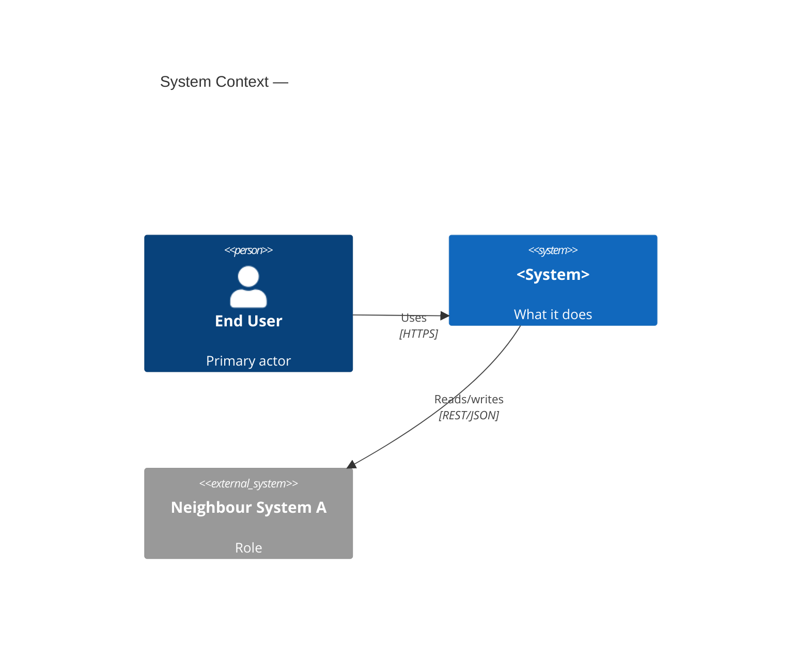
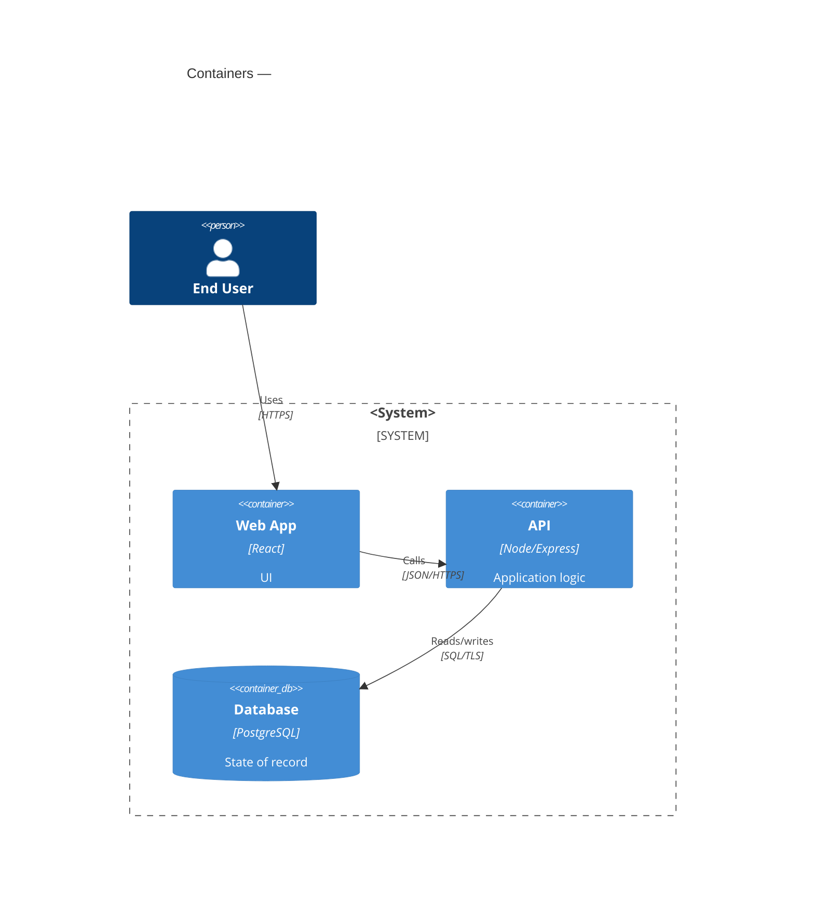
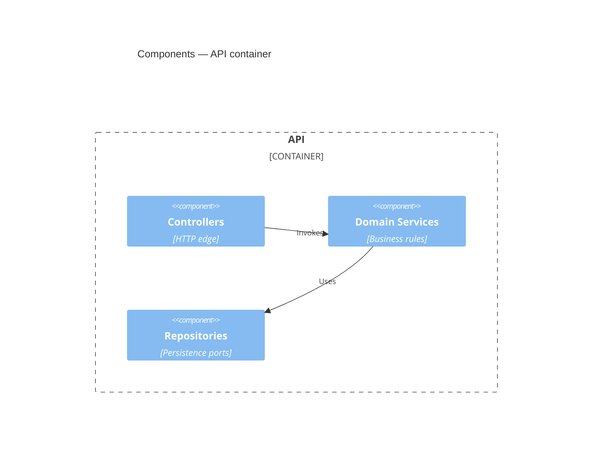
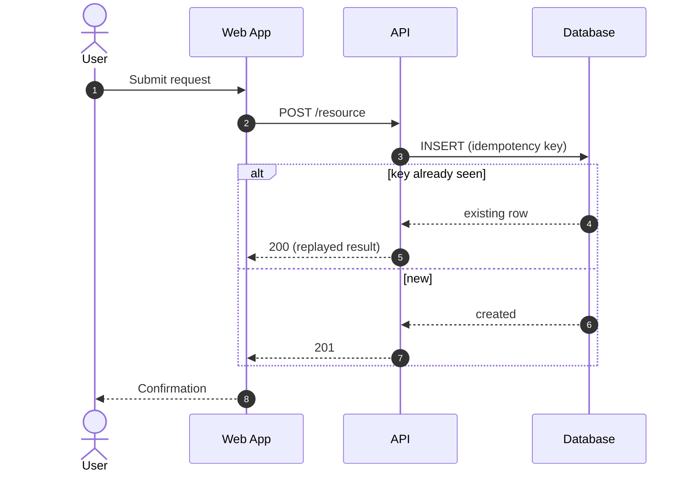
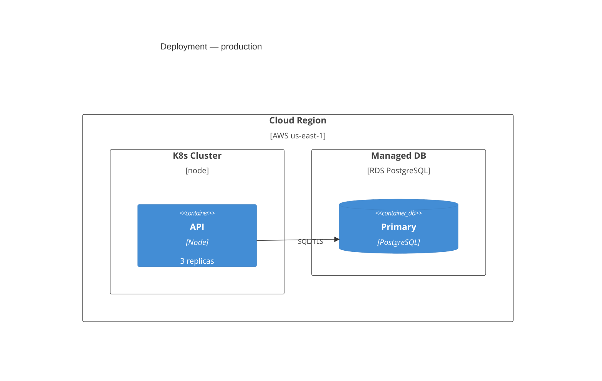

# arc42 Section Templates — prompt + acceptance bar per section

This is the per-section authoring playbook. For each of the 12 arc42 sections it
gives: the **prompt** (the questions whose answers become the section content)
and the **acceptance bar** (the testable definition of "done"). The bar is what
you check a section against before moving on. If a section cannot clear its bar
from the inputs you have, leave its heading plus an explicit `> TODO:` naming the
missing input — never delete the section, never invent facts.

Diagram notation is pinned: **C4 for structure (sections 3, 5, 7), UML for
behavior (section 6).** Ready-to-fill skeletons are at the bottom.

---

## 1. Introduction and Goals

**Prompt**
- In one paragraph, what does the system do and for whom?
- What are the top 3–5 **quality goals** (e.g. availability, time-to-market,
  security, modifiability)? Order them — the order itself is a decision.
- Who are the key stakeholders, and what is each one's concern / expectation?

**Acceptance bar**
- A short system summary that a new engineer can read in under a minute.
- A ranked quality-goals table with 3–5 rows; each goal names the driving
  motivation. Each goal here MUST have a matching measurable scenario in §10.
- A stakeholder table: role, contact/representative, expectation. No empty cells.

---

## 2. Constraints — *source feed*

**Prompt**
- What technical constraints are fixed (language, runtime, target platform,
  approved libraries, integration protocols)?
- What organizational constraints apply (team structure, process, schedule,
  budget, standards to comply with)?
- What political / conventional constraints apply (mandated vendors, naming
  conventions, legal/regulatory rules)?

**Acceptance bar**
- Three labelled groups: Technical / Organizational / Political-Conventional.
- Each constraint is one atomic, IDed, testable statement (see
  `constraints-guide.md`). "We use approved crypto libs" fails; "All data at rest
  is encrypted with AES-256 via the platform KMS" passes.
- Section is marked `<!-- source-feed -->` so extraction tooling finds it.

---

## 3. Context and Scope

**Prompt**
- **Business context:** which external actors (users, neighbour systems) does the
  system exchange information with, and what do they exchange?
- **Technical context:** which channels, protocols, and data formats cross the
  system boundary?
- What is explicitly **out of scope**?

**Acceptance bar**
- A C4 **System Context** diagram (skeleton below): the system as one box, every
  external actor and neighbour system around it, every relationship labelled with
  what flows and over what protocol.
- A table backing the diagram: partner, direction (in/out/both), payload, format,
  protocol.
- An explicit out-of-scope list.

---

## 4. Solution Strategy — *source feed*

**Prompt**
- What are the fundamental technology decisions (stack, frameworks, data stores,
  integration style)?
- What is the top-level decomposition approach (layers? hexagonal? services?)?
- For **each** quality goal from §1, what architectural approach achieves it?

**Acceptance bar**
- A table mapping every §1 quality goal → the strategic approach that meets it.
  No quality goal left unaddressed.
- Each fundamental decision is stated atomically, carrying its own driver and
  rationale inline (see `solution-strategy-guide.md`).
- Marked `<!-- source-feed -->`.

---

## 5. Building Block View

**Prompt**
- **Level 1:** decompose the whole system (whitebox) into its top-level building
  blocks. What is each one responsible for, and how do they relate?
- **Level 2+:** for each block complex enough to warrant it, zoom in (whitebox of
  that block) into its sub-blocks.

**Acceptance bar**
- A C4 **Container** diagram for Level 1 and a C4 **Component** diagram for each
  zoomed block. Every box has a single, stated responsibility.
- A blackbox table per level: name, responsibility, interface(s).
- Every building block named here must later appear in §6 (runtime) or §7
  (deployment) — no orphan blocks.

---

## 6. Runtime View

**Prompt**
- Which 3–6 runtime scenarios matter most (a core use case, startup, error/retry
  path, a cross-cutting flow like auth)?
- For each, how do the §5 building blocks collaborate over time?

**Acceptance bar**
- One **UML sequence diagram** per chosen scenario (skeleton below). Lifelines are
  building blocks from §5 — names must match exactly.
- Each scenario states its trigger and its end condition.
- Error and retry behavior is shown for at least one scenario, not only happy paths.

---

## 7. Deployment View

**Prompt**
- What are the target environments (dev / staging / prod) and their nodes?
- Which building block / container runs on which node, and over which channels do
  nodes communicate?
- What infrastructure constraints (regions, zones, scaling units) apply?

**Acceptance bar**
- A C4 **Deployment** (or UML deployment) diagram: nodes, the artifacts deployed
  to each, and the communication channels with protocols.
- A node table: node, environment, hosted containers, sizing/scaling note.
- Mapping is complete: every container from §5 lands on a node.

---

## 8. Crosscutting Concepts — *source feed*

**Prompt**
- Domain model, persistence, security/authn-authz, error handling, logging &
  observability, idempotency, and any other concern spanning building blocks.

**Acceptance bar**
- One subsection per concept, each stating the canonical pattern and the rule the
  rest of the code follows (see `crosscutting-concepts-guide.md`).
- Each concept is extraction-shaped (IDed, atomic, present-tense rule).
- Marked `<!-- source-feed -->`.

---

## 9. Architecture Decisions

**Prompt**
- Which decisions are significant, costly to reverse, or contested enough to
  record?

**Acceptance bar**
- Not authored. This project keeps no ADRs and no section 9. Decision results
  live in §2, §4 and §8 as current state.

---

## 10. Quality Requirements

**Prompt**
- Build a quality tree (refine the §1 goals into sub-qualities).
- For each leaf, write a concrete scenario: **stimulus → environment → response →
  response measure**.

**Acceptance bar**
- A quality-scenario table where every row is measurable (has a number/threshold).
  "Fast" fails; "p95 read latency ≤ 200 ms at 1k rps" passes.
- Every §1 quality goal is represented by at least one scenario.

---

## 11. Risks and Technical Debt

**Prompt**
- What are the known architectural risks? What technical debt has been accepted?

**Acceptance bar**
- A table: item, type (risk | debt), impact, likelihood (for risks),
  owner, mitigation or pay-down plan. No row without an owner.

---

## 12. Glossary

**Prompt**
- Which domain and technical terms need a single agreed definition to avoid
  ambiguity?

**Acceptance bar**
- A two-column term/definition table. Each term defined once; no synonyms left
  undisambiguated. Terms used in §1–§11 that a newcomer would not know appear here.

---

## Diagram skeletons

### C4 System Context (§3)

### C4 Container (§5, Level 1)

### C4 Component (§5, Level 2 — zoom one container)

### UML Sequence (§6, one per scenario)

### C4 Deployment (§7)

> All mermaid fences live in these reference files only — never in SKILL.md.
