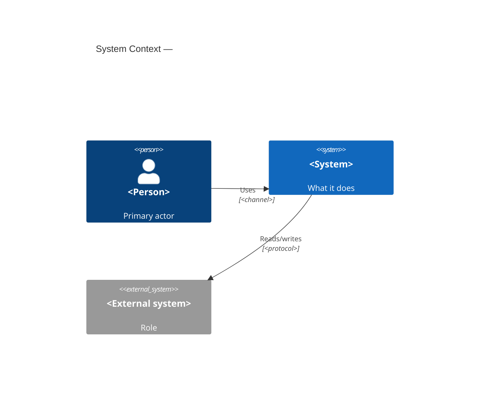
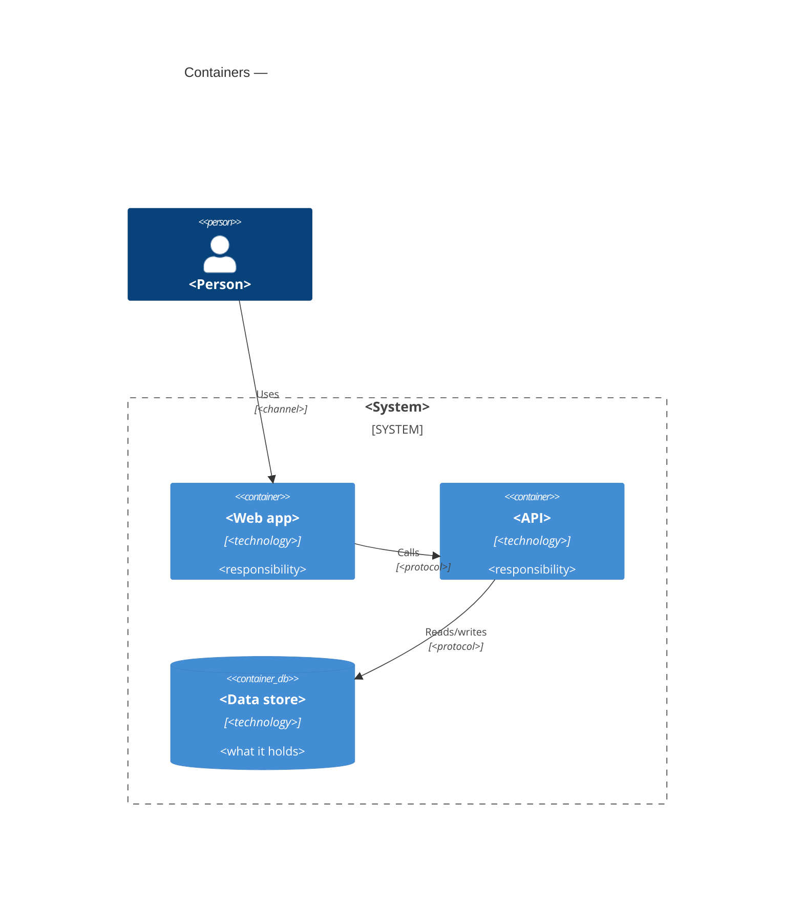
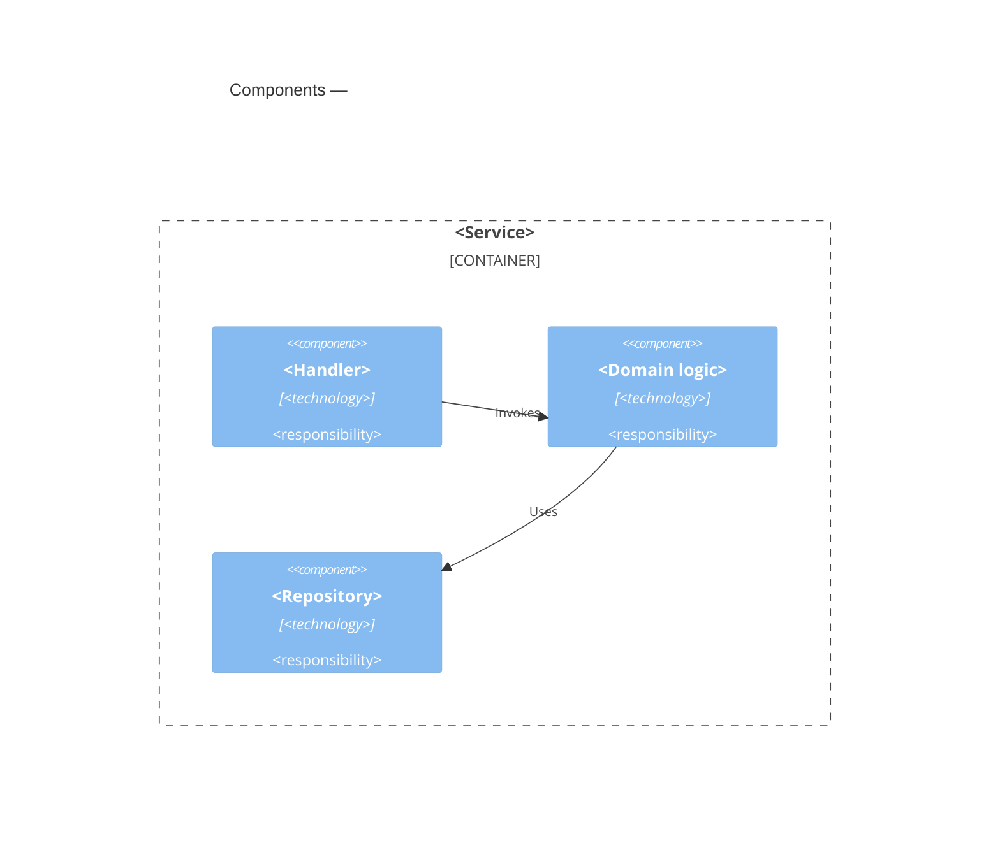
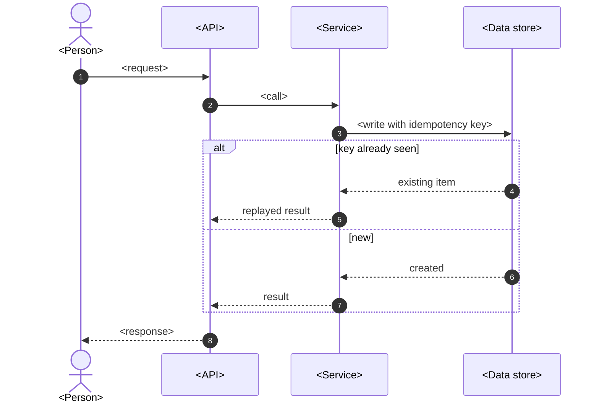
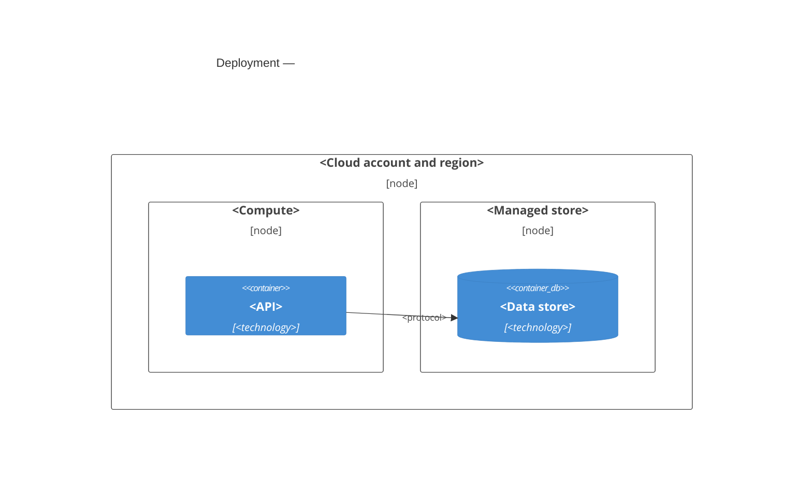

# Section templates — what each section's views hold

For each arc42 section: where its views live, which views it usually needs at each scope, and what
makes a view complete. The view types come from the MENU (`reference/diagram-and-model-types.md`
under the architecture root); the table of scopes and views is the MODEL's, and this file follows
it. The views a subject needs depend on what it is: the lists below are where to start, not a
checklist.

Apply the MODEL's coverage conditions and prose-only exceptions; these templates are not a
checklist of mandatory diagrams. A section entry point embeds or links its highest-scope view as
the MODEL permits.

Every diagram view is a diagram and the prose around it, carries the catalog frontmatter, and describes the
design its version holds (`../../arc42/references/living-document-rules.md`). Skeletons are at the
bottom.

---

## 1. Introduction and Goals — `01-introduction-and-goals/README.md`

What the system is for, its top quality goals in priority order, and its stakeholders. Requirements
stay in PRDs; this section orients the reader.

---

## 2. Architecture Constraints — `02-architecture-constraints/README.md`

The owner's constraints. Not authored here: see `constraints-guide.md`.

---

## 3. Context and Scope — `03-context-and-scope/`

| Scope | Views |
|---|---|
| System | system context diagram; landscape diagram |

Complete when: the system is one box, every person and external system around it is shown, and every
relationship is labelled with what crosses the boundary and over what channel. The prose names what
is outside the system's scope.

---

## 4. Solution Strategy — `04-solution-strategy/README.md`

The architectural style and the few approaches everything else follows, about one page. See
`solution-strategy-guide.md`.

---

## 5. Building Block View — `05-building-block-view/`

| Scope | Views | Where |
|---|---|---|
| System | container diagram; integration diagram; N-tier (layers) diagram | `README.md` or its directly linked overview, as the MODEL permits |
| Domain | context map and domain model; container view of its services; integration | `<domain>/README.md` |
| Service | component diagram; logical and physical data model or ERD | `<domain>/<service>/...` |
| Component | class, module or package diagram; physical data model; state machine | `<domain>/<service>/<component>...` |

Complete when: every box has one stated responsibility, every element in a service's views also
appears in the container view of its domain and the system, and every data store shows its keys and
access patterns in its data model.

---

## 6. Runtime View — `06-runtime-view/`

| Scope | Views | Where |
|---|---|---|
| System | event and data flow across services; key end-to-end sequences | `<flow>.md` |
| Service | sequence, state machine and activity diagrams for its important flows | `<domain>/<service>/...` |

Complete when: every participant is an element shown in a section 5 view or an external system in
section 3, each flow states its trigger and its end, and the failure and retry path is shown where
the flow has one.

---

## 7. Deployment View — `07-deployment-view/`

| Scope | Views | Where |
|---|---|---|
| System | deployment, infrastructure and environment diagrams | `README.md` or its directly linked overview, as the MODEL permits |
| System | network diagram | `network.md` |
| Service | deployment of its stacks | `<domain>/<service>/...` |

Complete when: every container in section 5 lands on infrastructure in a deployment view, and every
channel between nodes names its protocol.

---

## 8. Crosscutting Concepts — `08-crosscutting-concepts/<concept>.md`

| Scope | Views |
|---|---|
| Concept | the concept's structure (class, component) and behaviour (sequence, activity) |

See `crosscutting-concepts-guide.md`.

---

## 10. Quality Requirements — `10-quality-requirements/README.md`

The quality scenarios the architecture is designed to meet: stimulus, environment, response and a
measurable response measure. Every top quality goal in section 1 has at least one scenario.

---

## 11. Risks and Technical Debt — `11-risks-and-technical-debt/README.md`

Known risks and accepted debt in the current design, each naming the element it affects. Work still
to do is a bead, not an entry here.

---

## 12. Glossary — `12-glossary/README.md`

The terms the architecture uses, each defined once, so every view and diagram label means the same
thing by the same word.

---

## Catalog frontmatter skeleton

```yaml
---
view_type: component diagram       # a type from the MENU
scope: service                     # system | domain | service | component | concept
subject: <service>                 # the one thing this view describes
shows:                             # every element that appears in the view
  - <component-a>
  - <component-b>
lifecycle_state: in-review         # in-review until an architecture review approves it
---
```

## Diagram skeletons

### System context (section 3)


```mermaid
C4Context
  title System Context — <system>
  Person(user, "<Person>", "Primary actor")
  System(sys, "<System>", "What it does")
  System_Ext(extA, "<External system>", "Role")
  Rel(user, sys, "Uses", "<channel>")
  Rel(sys, extA, "Reads/writes", "<protocol>")
```

### Container (section 5, system scope)


```mermaid
C4Container
  title Containers — <system>
  Person(user, "<Person>")
  System_Boundary(b, "<System>") {
    Container(web, "<Web app>", "<technology>", "<responsibility>")
    Container(api, "<API>", "<technology>", "<responsibility>")
    ContainerDb(db, "<Data store>", "<technology>", "<what it holds>")
  }
  Rel(user, web, "Uses", "<channel>")
  Rel(web, api, "Calls", "<protocol>")
  Rel(api, db, "Reads/writes", "<protocol>")
```

### Component (section 5, service scope)


```mermaid
C4Component
  title Components — <service>
  Container_Boundary(svc, "<Service>") {
    Component(handler, "<Handler>", "<technology>", "<responsibility>")
    Component(domain, "<Domain logic>", "<technology>", "<responsibility>")
    Component(store, "<Repository>", "<technology>", "<responsibility>")
  }
  Rel(handler, domain, "Invokes")
  Rel(domain, store, "Uses")
```

### Sequence (section 6, one per flow)


```mermaid
sequenceDiagram
  autonumber
  actor U as <Person>
  participant A as <API>
  participant S as <Service>
  participant D as <Data store>
  U->>A: <request>
  A->>S: <call>
  S->>D: <write with idempotency key>
  alt key already seen
    D-->>S: existing item
    S-->>A: replayed result
  else new
    D-->>S: created
    S-->>A: result
  end
  A-->>U: <response>
```

### State machine (section 5 or 6)


```mermaid
stateDiagram-v2
  [*] --> <State1>
  <State1> --> <State2>: <event>
  <State2> --> <State1>: <event>
  <State2> --> [*]
```

### Deployment (section 7)


```mermaid
C4Deployment
  title Deployment — <environment>
  Deployment_Node(cloud, "<Cloud account and region>") {
    Deployment_Node(compute, "<Compute>") {
      Container(api, "<API>", "<technology>")
    }
    Deployment_Node(storage, "<Managed store>") {
      ContainerDb(db, "<Data store>", "<technology>")
    }
  }
  Rel(api, db, "<protocol>")
```
