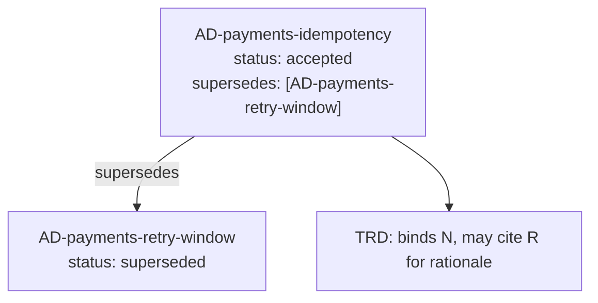

# TRD & spec feed contract

This file is the agreement between `arc42-extract` (the producer) and the two downstream consumers —
the **TRD author** and the **spec authors**. They build their documents by iterating the packet, so
they need guarantees about what is always present, what is stable, and how change is signaled. This
contract is what lets the producer and consumers evolve independently without silent breakage.

## Position in the pipeline

```mermaid
flowchart LR
  SAD["arc42 SAD\n(authoring side)"] -->|read-only| EX["arc42-extract\n(this skill)"]
  EX -->|typed packet\n(extraction-schema)| TRD["TRD author"]
  EX -->|typed packet\n(same IDs)| SPEC["Spec authors"]
  TRD -.cites IDs.-> SPEC
```

Extraction is strictly read-only: the SAD is never modified. The packet is the only thing that
crosses the boundary, and both consumers receive the **same** packet with the **same** IDs, so a
constraint cited in the TRD and the same constraint cited in a spec resolve to one identifier.

## Guarantee 1 — the four buckets always exist

The packet always contains all four buckets: `constraints` (§2), `solutionStrategy` (§4),
`crosscuttingConcepts` (§8), `decisions` (§9). A consumer may iterate any bucket without a
presence check. A section absent from the SAD is **not** dropped — its bucket carries
`present: false`, an empty `entries` list, and a human-readable `missingReason`. This means
"section 9 was missing from the SAD" is a fact the TRD author can see and act on, never an
ambiguous silence.

## Guarantee 2 — every entry has the four core fields

Every entry, in every bucket, exposes `id`, `sourceSection`, `statement`, and `rationaleRef`
(see `extraction-schema.md`). Consumers can write one generic renderer over `Entry` and apply it to
all four buckets. `rationaleRef` may be `null`; `id`, `sourceSection`, and `statement` are never
empty.

## Guarantee 3 — IDs are stable and content-anchored

IDs are deterministic functions of SAD content, not of position. Re-running extraction on an
unchanged SAD yields byte-identical IDs. Reordering sections in the SAD does not change any ID.
Therefore a downstream document that cites `AD-payments-idempotency` keeps resolving to the same
decision across re-extractions, and a diff between two extractions is meaningful: a new ID is a new
fact, a vanished ID is a removed fact, a changed `statement` under a changed ID is a materially
revised fact.

Consumers MUST treat the ID as opaque beyond its one-character bucket prefix (`C-`, `S-`, `X-`,
`AD-`). They cite it; they do not parse it.

## Guarantee 4 — no invention

The producer emits nothing the SAD does not state. If `rationaleRef` is `null`, the SAD genuinely
gave no rationale — the consumer must not assume one was lost. If a bucket is empty, the SAD's
section was empty or absent, not silently filtered. Consumers can trust that the packet is a faithful
projection of the SAD and that any gap they see is a real gap in the source architecture document
(which is itself useful signal for the TRD author to escalate).

## Guarantee 5 — supersession is carried, never resolved away

When section 9 contains a decision that supersedes an earlier one, **both** decisions appear in the
`decisions` bucket. The superseding entry lists the superseded ID(s) in its `supersedes` array and
typically carries `status: "accepted"`; the superseded entry typically carries
`status: "superseded"` or `status: "deprecated"` as the SAD wrote it. The producer does **not**
delete the superseded decision — removing it would erase the audit trail the TRD author needs to
explain why a requirement changed.

How consumers use this:

- The **TRD author** treats only the non-superseded ("live") decisions as binding requirements, but
  may reference the superseded one to justify a change in direction.
- A **spec author** that finds a spec tracing to a superseded decision knows that spec needs revision.

Supersession resolution is therefore a consumer concern. The producer's job is to make the graph
explicit and lossless.



## What the contract does NOT promise

- **No ordering guarantee across re-runs beyond determinism.** Entries appear in stable document
  order, but consumers that need a specific ordering should sort by `id` or `sourceSection`
  themselves.
- **No semantic deduplication.** If the SAD states the same constraint in two places, two entries
  appear (with distinct disambiguated IDs). Collapsing duplicates is a consumer decision, because
  only the consumer knows whether the duplication is meaningful.
- **No cross-section linking beyond §9 supersession.** The producer does not infer that a §8 concept
  "implements" a §4 strategy. Such linkage, if needed, is authored downstream.
- **No requirement language.** The packet contains the SAD's statements as written. Turning a
  constraint into a testable requirement ("the system SHALL …") is the TRD author's job, not the
  producer's.

## Versioning

The packet carries `schemaVersion`. A breaking change to the `Entry` shape or bucket structure bumps
the major version; consumers SHOULD assert the major version they support and fail loudly on
mismatch rather than mis-reading a newer packet.
