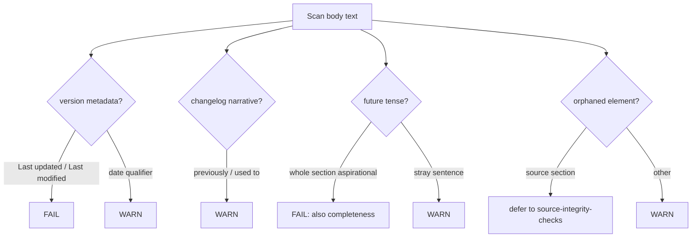

# Living-Document Antipatterns

A SAD is a **living document**: it states the architecture *as it is now*. It is not a logbook, a
roadmap, or a diary. When a doc starts carrying its own history or its own future, it rots — readers
can no longer trust that what they read is the current truth. This file lists the smells to flag and
how to evidence each one. All of these are hygiene findings; none of them change the architecture, so
they are typically `WARN`, except where noted as `FAIL`.

## 1. Inline version metadata

The single hardest rule. The SAD body must not embed its own change-tracking. Version history belongs
in git, not in prose.

**Flag any of:** `Last updated`, `Last modified`, `Revision history`, `Changelog`, `v1.3 — 2024-…`,
`Updated by`, `Date: …` headers attached to sections, "as of <date>" qualifiers on architectural claims.

- **Severity:** `FAIL` for `Last updated` / `Last modified` / a `Revision history` table — these are
  the canonical rot markers. `WARN` for softer date qualifiers ("as of Q2").
- **Evidence:** quote the exact offending line.
- **Why it matters:** the document this very skill lives in is itself forbidden from containing those
  phrases — a verifier that tolerates them in the artifact it checks would be self-contradictory.

## 2. Changelog / diary narrative

Prose that narrates the document's own evolution rather than describing the system.

**Flag phrasing like:** "Previously we used X but switched to Y", "In the last revision we added…",
"This section was rewritten to…", "Originally the design called for…", "We used to…".

- **Severity:** `WARN`.
- **Evidence:** quote the narrating sentence.
- **Note:** every section states current truth only — there is no superseded-decision
  exemption. A paragraph that says "we changed our mind about the database last
  sprint" is a smell.

## 3. Future-tense / aspirational content

The SAD describes the architecture that exists, not the one someone hopes to build. Future-tense prose
makes it impossible to tell whether a claim is real.

**Flag phrasing like:** "we will eventually", "in the future we plan to", "this should later be",
"a future version will", "we intend to migrate", "TODO", "TBD", "coming soon", "not yet implemented
but planned".

- **Severity:** `WARN` in general; `FAIL` when an entire required section's substance is future-tense
  (e.g. §7 Deployment View consists only of "deployment will be designed later") because that makes the
  section effectively empty and also trips a completeness `FAIL`.
- **Evidence:** quote the aspirational sentence.
- **Allowed exception:** §11 Risks and Technical Debt may discuss *anticipated* risk ("load may exceed
  capacity if traffic triples") — that is risk assessment, not aspiration, and is **not** a finding.
  Roadmap items belong in a roadmap, not in §4 or §5.

## 4. Orphaned sections

A section that exists structurally but connects to nothing — content with no inbound or outbound
relationship to the rest of the document.

**Flag:**
- A §5 building block never mentioned in §6, §7, or §8.
- A §8 crosscutting concept never applied in any other section.
- A §10 quality scenario whose parent goal does not appear in §1.
- A glossary term (§12) defined but never used in the body.
- A diagram with no surrounding prose, or prose referencing "the diagram below" where no diagram exists.

- **Severity:** `WARN` (orphans are integration gaps, not factual errors). Promote to `FAIL` only when
  the orphan is one of the three source sections (§2/§4/§8) and the orphaning breaks extractability —
  defer that judgment to `source-integrity-checks.md`.
- **Evidence:** name the orphaned element and state which expected reference is absent.

## 5. Stale / contradicted-by-self claims

Two statements in the document that cannot both be true at once (within hygiene scope — deeper
source-section contradictions are covered separately).

**Flag:** a number, name, or count repeated inconsistently — "three services" in §1 versus four blocks
in §5; a component called `auth-svc` in §5 and `AuthService` in §7 with no glossary alias; a stated
constraint "PostgreSQL only" against a §7 deployment showing MongoDB.

- **Severity:** `WARN` for naming drift; escalate to `FAIL` and hand off to `source-integrity-checks.md`
  when the contradiction is between two of §2/§4/§8.
- **Evidence:** quote both conflicting statements with their section numbers.

## Reporting

Group all hygiene findings under the **Living-document hygiene** heading of the verdict. Each is
`[STATUS] §<n> <smell> — <observation>` with an indented `evidence:` line. Report the smell; never
delete or rewrite the offending text — that is the author's job via the `arc42` skill.
