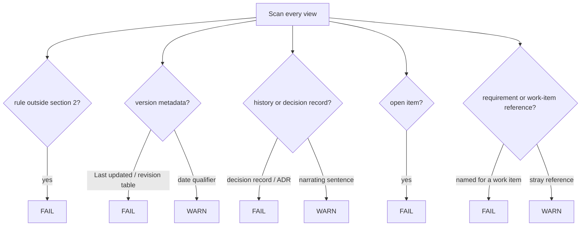

# Content antipatterns

Every version of the architecture describes the design it holds, as it is. When a view starts
carrying its history, its open questions, its requirements or its rules, a reader can no longer trust
that it says what the design is. This file lists what to flag and how to evidence it.

## 1. Rules outside section 2

Section 2 holds the owner's constraints. Everything else is a description of the design, followed as
an established pattern, not a rule.

**Flag:** "MUST", "MUST NOT", "SHALL", "is required to", "is forbidden", "never" or "always" used to
command the design rather than describe it; tagged rule ids (`C-`, `S-`, `X-`, `AD-`, `D-`) on
entries; a section 8 concept written as a list of rules.

- **Severity:** `FAIL`.
- **Evidence:** quote the sentence and give its path.

## 2. Inline version metadata

**Flag:** `Last updated`, `Last modified`, `Revision history`, `Changelog`, `v1.3 — <date>`,
`Updated by`, dated section headers, "as of <date>" on a design claim.

- **Severity:** `FAIL` for `Last updated`, `Last modified` or a revision table; `WARN` for softer
  date qualifiers.
- **Evidence:** quote the line.

## 3. History and decision records

**Flag:** "previously we used X but switched to Y", "originally the design called for", "we used to",
"this section was rewritten to", "we decided", "rejected alternatives", a decision table, an ADR, a
decision log, a supersession note.

- **Severity:** `FAIL` for a decision record, ADR or decision log; `WARN` for a stray narrating
  sentence.
- **Evidence:** quote the text.

## 4. Open items

An open item is workflow state. It belongs in beads and in the run's report, not in a view.

**Flag:** "Open question", "Open:", "TBD", "TODO", "pending", "undecided", "unresolved", "referred to
the owner", "routed to", "escalated", "until the owner rules", "named required action".

- **Severity:** `FAIL`.
- **Evidence:** quote the sentence.

## 5. Requirements and work-item references

Requirements live in PRDs; nothing in the architecture is addressed to one PRD, Epic or bead.

**Flag:** "the PRD requires", "per the PRD", acceptance criteria, an Epic or bead id in a view, a view
or folder named for a PRD or Epic.

- **Severity:** `FAIL` for a view or folder named for a work item; `WARN` for a stray reference.
- **Evidence:** quote the text or give the path.

## 6. Aspirational content in the effective version

The effective version describes the approved design. A proposed change belongs in a target.

**Flag, in `arc42/`:** "we will eventually", "in the future we plan to", "a future version will",
"we intend to migrate", "planned".

- **Severity:** `WARN`; `FAIL` when a view's substance is a plan rather than a design.
- **Evidence:** quote the sentence.
- **Exception:** section 11 may describe an anticipated risk ("load may exceed capacity if traffic
  triples"); that is a risk, not a plan.

## 7. Views without prose or without a diagram

A view is a diagram and the prose around it; one without the other is the exception.

**Flag:** a diagram with no prose stating what the view is for; a long prose view at system,
domain or service scope with no diagram; prose referring to "the diagram below" where none exists.

- **Severity:** `WARN`.
- **Evidence:** give the path and name what is missing.

```mermaid
flowchart TD
  scan[Scan every view] --> rule{rule outside section 2?}
  rule -->|yes| failR[FAIL]
  scan --> meta{version metadata?}
  meta -->|"Last updated / revision table"| failM[FAIL]
  meta -->|date qualifier| warnM[WARN]
  scan --> hist{history or decision record?}
  hist -->|decision record / ADR| failH[FAIL]
  hist -->|narrating sentence| warnH[WARN]
  scan --> open{open item?}
  open -->|yes| failO[FAIL]
  scan --> req{requirement or work-item reference?}
  req -->|named for a work item| failQ[FAIL]
  req -->|stray reference| warnQ[WARN]
```

## Reporting

Group every finding from this file under the **Content hygiene** heading of the verdict, as
`[STATUS] <path> — <antipattern>: <observation>` with an indented `evidence:` line. Report the text;
never delete or rewrite it.
