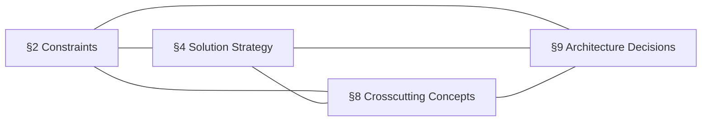

# Source-Section Integrity — §2, §4, §8, §9

Four arc42 sections are treated as **source sections** because downstream consumers extract them as
standalone, machine-or-human-liftable inputs:

| § | Section | Extracted as | Consumed by |
|---|---------|--------------|-------------|
| 2 | Architecture Constraints | The fixed boundary conditions the design must honor | Governance, audit, compliance review |
| 4 | Solution Strategy | The chosen fundamental approach and tactics | Implementation teams, onboarding |
| 8 | Crosscutting Concepts | The system-wide concepts (security, persistence, error handling, domain model) | Every implementer, applied across blocks |
| 9 | Architecture Decisions | The ADR record with status and rationale | Governance, future-decision context |

Integrity holds when all three properties below are true. Verify them in order: a section that is
absent cannot be extractable, and two sections that are not both extractable cannot be checked for
contradiction.

## Property 1 — Presence

Each of §2, §4, §8, §9 must exist with real content (not a placeholder, not empty — see the
completeness rules in `verification-checklist.md`). A missing source section is a `FAIL` here **and**
a completeness `FAIL`; report it in both families so the verdict is unambiguous.

- Evidence for a presence FAIL: name the section and state "heading present, body empty" or "section
  absent from document".

## Property 2 — Individual Extractability

Each source section must be **liftable in isolation**: a reader could copy that one section out of the
SAD and it would still make sense as a self-contained artifact, without silently depending on prose
that lives only in another section.

A source section is **extractable** when:

- It has a single, unambiguous boundary — one `## N. Title` heading, content beneath it, ending at the
  next section heading. No content for §4 leaking into §3 or §5.
- Its items are individually addressable — constraints in §2 are enumerated or itemized (not one
  undifferentiated paragraph); decisions in §9 are discrete ADRs with IDs; concepts in §8 are named.
- It does not depend on undefined forward references — if §4 says "as decided in ADR-007", ADR-007
  must actually exist in §9. A dangling reference breaks extractability because the lifted section is
  incomplete on its own.
- It carries its own minimal context — a §9 decision states its own status and rationale inline, not
  "rationale: see section 4 above".

A source section is **not extractable** (→ `FAIL`) when its meaning is only recoverable by reading a
different section, when its items cannot be told apart, or when it references content that does not
exist. Evidence: name the section and the specific reason ("§2 is a single paragraph; constraints are
not individually addressable" or "§4 references ADR-011 which is absent from §9").

## Property 3 — Mutual Non-Contradiction

The four source sections must not contradict each other. This is the highest-value integrity check,
because a SAD where the constraints forbid what the strategy chooses is internally false regardless of
how complete it looks. Assert each pairwise relationship:

| Pair | Must hold | Contradiction example (→ FAIL) |
|------|-----------|--------------------------------|
| §2 ↔ §4 | The strategy must operate *within* the constraints | §2: "no third-party data processors"; §4: "use a managed SaaS analytics pipeline" |
| §2 ↔ §9 | Every decision must respect every constraint | §2: "on-prem only"; §9 ADR-004: "deploy to AWS Lambda" |
| §4 ↔ §9 | The decisions must implement, not undercut, the strategy | §4: "event-driven decomposition"; §9: "decision to use a single synchronous monolith" |
| §4 ↔ §8 | Crosscutting concepts must support the strategy's tactics | §4: "stateless services for horizontal scaling"; §8 persistence concept: "in-process session state held in each instance" |
| §8 ↔ §9 | Decisions must be consistent with the documented concepts | §8 security concept: "all traffic mTLS"; §9: "decision to expose an unauthenticated public endpoint" |
| §2 ↔ §8 | Crosscutting concepts must honor the constraints | §2: "GDPR — EU data residency"; §8 persistence: "single global replica in us-east-1" |

For each pair, read both sections, identify the assertions each makes (a constraint, a chosen
approach, a documented concept, a decision), and check for a direct conflict. A conflict is two
statements that cannot both be true of the same running system. Report it once, under the worse-named
section, and cross-reference the other.

- **Severity:** every confirmed contradiction is a `FAIL`. Do not downgrade.
- **Evidence:** quote *both* conflicting statements with their section numbers — a contradiction
  finding is only credible when both halves are shown.

(Every edge is a non-contradiction assertion; the four nodes form a complete graph — six pairs to check.)

## Reporting

Emit findings under the **Source-section integrity** heading of the verdict, in this order: presence
failures, then extractability failures, then contradictions. A clean run reports
`[PASS] §2, §4, §8, §9 each present, independently extractable, and mutually non-contradictory`.
Report integrity as observed; never resolve a contradiction by editing either section — that decision
belongs to the architect and the `arc42` authoring skill.
