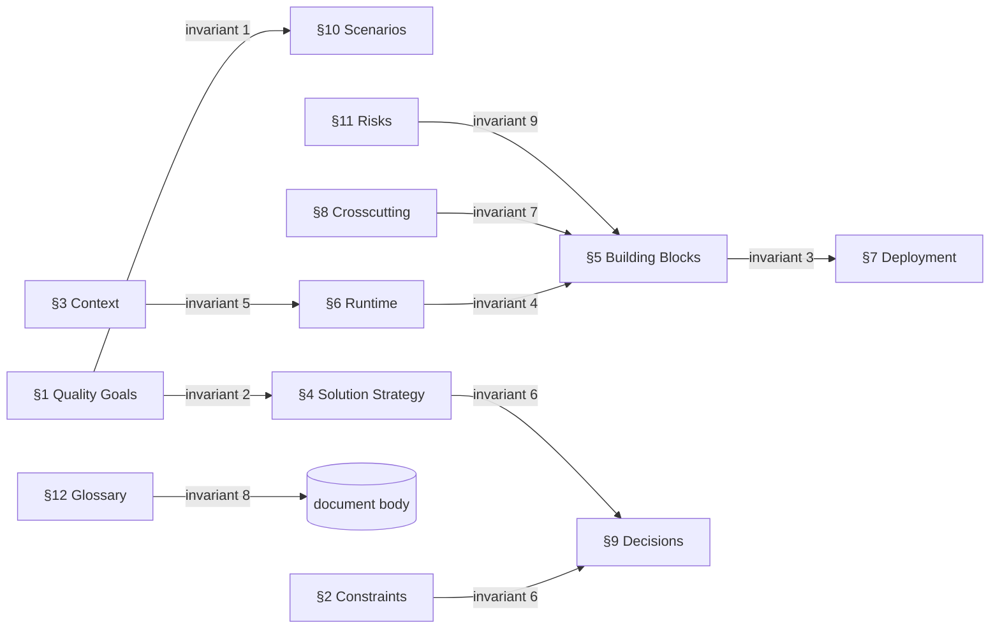

# Verification Checklist — Completeness and Consistency

This file holds the assertions for two of the four families: **completeness** (every arc42 section is
present, ordered, and non-empty) and **consistency** (the cross-section invariants that must hold for
the document to describe one coherent system). Run completeness first; a missing section short-circuits
the consistency checks that depend on it.

## Part A — 12-Section Completeness

arc42 fixes the section set and their order. The SAD must contain all twelve, numbered 1–12, in
sequence. A heading with no body, or a body consisting only of the template's placeholder prompt
(e.g. "Describe the relevant constraints…"), counts as **absent** — flag it `FAIL`, not `WARN`.

| § | Section | Present-and-non-empty means | FAIL when |
|---|---------|------------------------------|-----------|
| 1 | Introduction and Goals | States the system's purpose, the top 3–5 quality goals, and the stakeholder list | No quality-goal table, or goals are generic ("be fast") with no priority |
| 2 | Architecture Constraints | Lists technical, organizational, and convention constraints that are *given*, not chosen | Empty, or conflates constraints with decisions (a chosen tech is a §4/§9 item, not a constraint) |
| 3 | Context and Scope | Defines system boundary; names external systems/actors and the interfaces across the boundary | No business context or no technical context; boundary undefined |
| 4 | Solution Strategy | Summarizes the fundamental decisions and approach: tech choices, decomposition, quality-goal tactics | Empty, or merely restates §1 goals without naming an approach |
| 5 | Building Block View | Decomposes the system into building blocks with responsibilities; at least the level-1 whitebox | No level-1 decomposition, or blocks listed with no responsibilities |
| 6 | Runtime View | Shows how building blocks collaborate in important scenarios (sequences/flows) | Empty, or no scenario tied to a §1 quality goal |
| 7 | Deployment View | Maps building blocks to infrastructure/nodes; shows the technical deployment | No node-to-block mapping; only a prose mention of "the cloud" |
| 8 | Crosscutting Concepts | Documents concerns that span blocks: domain model, persistence, security, error handling, etc. | Empty, or each concept is a one-liner with no actual concept content |
| 9 | Architecture Decisions | Records important, expensive, risky, or large-scale decisions (ADR-style) with status and rationale | Empty, or decisions have no rationale / no status |
| 10 | Quality Requirements | A quality tree plus concrete, measurable quality scenarios | Goals stated without measurable scenarios; no scenario references a stimulus + response + measure |
| 11 | Risks and Technical Debt | Names known risks and accumulated debt with assessment | Empty, or "none" with no justification |
| 12 | Glossary | Defines domain and technical terms used across the document | Empty, or missing terms the document actually uses |

**Ordering and numbering checks:**

- Headings appear in ascending §1→§12 order. A section out of order is a `FAIL` even if all are present.
- No duplicate section numbers; no skipped numbers.
- No extra top-level "section 13+" masquerading as arc42 content — appendices are fine but must not be numbered into the arc42 sequence.

## Part B — Cross-Section Consistency Invariants

Completeness proves each section exists; consistency proves they describe **one** system. Assert each
invariant below. Each names the sections it spans and what to compare.

1. **Quality goals trace to scenarios.** Every top quality goal in §1 has at least one measurable
   scenario in §10. A goal with no scenario is a `FAIL`; a §10 scenario with no parent goal is a `WARN`.
2. **Quality goals trace to strategy.** Every §1 quality goal is addressed by at least one tactic or
   decision in §4 (Solution Strategy). A goal that no part of the strategy serves is a `FAIL`.
3. **Building blocks deploy.** Every level-1 building block in §5 appears in the §7 deployment mapping
   (or is explicitly noted as non-deployed, e.g. a build-time-only component). An undeployed runtime
   block is a `FAIL`.
4. **Runtime scenarios use real blocks.** Every participant in a §6 runtime scenario is a building
   block defined in §5 or an external system named in §3. A phantom participant is a `FAIL`.
5. **Context actors are consistent.** Every external system/actor in §6, §7, or the building-block
   interfaces of §5 is declared in the §3 context boundary. An undeclared external is a `FAIL`.
6. **Decisions trace to drivers.** Every §9 decision cites a driver — a §2 constraint, a §1 quality
   goal, or a §11 risk. A decision with no driver is a `WARN`; a decision that *contradicts* a §2
   constraint is a `FAIL` (and also a source-integrity failure — see `source-integrity-checks.md`).
7. **Crosscutting concepts are referenced.** Every §8 concept (security model, persistence approach,
   error handling) is applied somewhere in §5/§6/§7. A concept documented but never used is a `WARN`.
8. **Glossary covers used terms.** Every term defined in §12 is used in the body, and every clearly
   domain-specific term used repeatedly in the body is defined in §12. Unused definitions are `WARN`;
   undefined repeated domain terms are `WARN`.
9. **Risks reference reality.** Every §11 risk/debt item references a concrete block (§5), decision
   (§9), or constraint (§2) it threatens. A free-floating risk is a `WARN`.

## How to report from this file

For each table row and each invariant, emit one verdict line in the format
`[STATUS] §<n> <title> — <observation>` with an indented `evidence:` line quoting the offending
text or naming the absence. Do not propose the fix here — that belongs to the SAD author and the
`arc42` skill. Report only what is and is not true.
