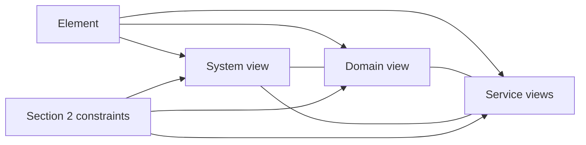

# View consistency checks

The same element appears in views at several scopes and in several versions. These checks assert that
the views describe one system: they agree with each other, every element has views of its own, no
view conflicts with the owner's constraints, and links resolve. Find the views for each element
through the catalog (`../../arc42/references/finding-views.md`) before comparing them.

## Check 1 — No two views contradict each other

For each element, read every view in the version that names it in `subject` or `shows`, at every
scope. Every view shows the same thing about it: name, responsibility, relationships, data, runtime
behaviour, deployment.

| Contradiction example (→ `FAIL`) |
|---|
| The system container view shows a synchronous call between two services; the runtime view shows an event |
| A data model's key differs from the key a sequence diagram queries |
| A service is deployed in one region in its stack view and another in the system deployment view |
| A component is named `auth-svc` in one view and `AuthService` in another, with no glossary entry joining the names (`WARN`) |

- **Severity:** `FAIL` for every confirmed contradiction; `WARN` for naming drift.
- **Evidence:** quote both statements, each with its path. A contradiction is credible only when both
  halves are shown.

For a target, also compare the target views with the delta: every change the target makes appears in
the delta, and the delta describes nothing the target does not hold.

## Check 2 — Applicable subjects have sufficient coverage

Establish subjects independently of the current catalog and apply the MODEL coverage obligations
at the reviewed scopes. Use `../../arc42/references/coverage-evidence.md`. Inspect the actual views,
including the needed parent and adjacent views, not only metadata. An element need not have a
separate document when an existing view sufficiently answers its applicable reader questions.

- **Severity:** `FAIL` for a demonstrated applicable obligation left absent or incomplete; explicitly
  report unassessed evidence or a justified not-applicable result using the MODEL's vocabulary.
- **Evidence:** name the subject, question, MODEL obligation, inventory sources, paths inspected and
  the content or named absence. Never infer a whole-project pass from a bounded change review.

## Check 3 — No view conflicts with a section 2 constraint

Read section 2. For every constraint, check the views that show what it governs.

- **Severity:** `FAIL`.
- **Evidence:** quote the constraint and the conflicting view, with both paths.

## Check 4 — No dangling links

Every link between views resolves to a file that exists, and to a heading that exists when the link
names one.

- **Severity:** `FAIL` for a link to a missing file; `WARN` for a missing heading.
- **Evidence:** the path holding the link and the target it names.

(Every edge between views is a non-contradiction assertion; every edge from section 2 is a
no-conflict assertion.)

## Reporting

Emit findings under the **View consistency** heading of the verdict, in check order. A clean run
reports `[PASS] views agree at every scope; applicable subjects have sufficient coverage; no constraint conflicts;
no dangling links`. Never resolve a contradiction by editing a view: that belongs to `arc42-maintain`
or a new target.
