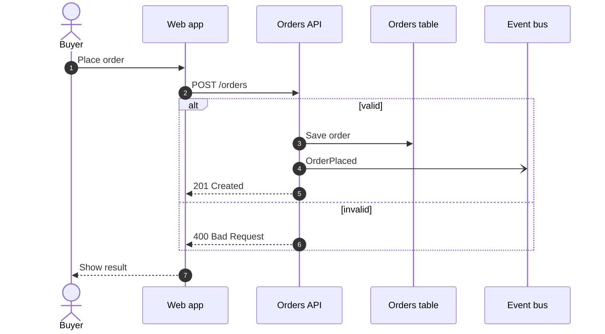
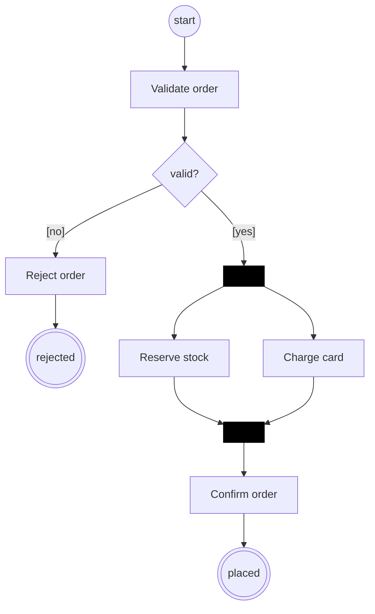
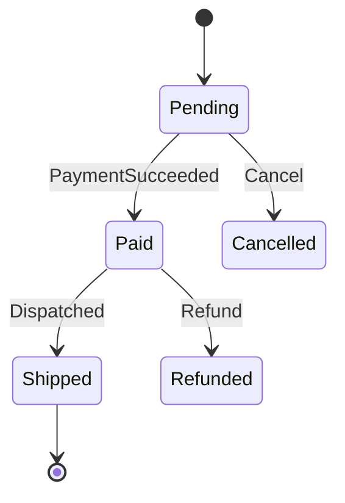
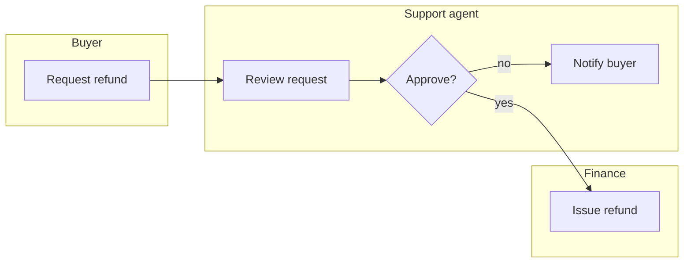
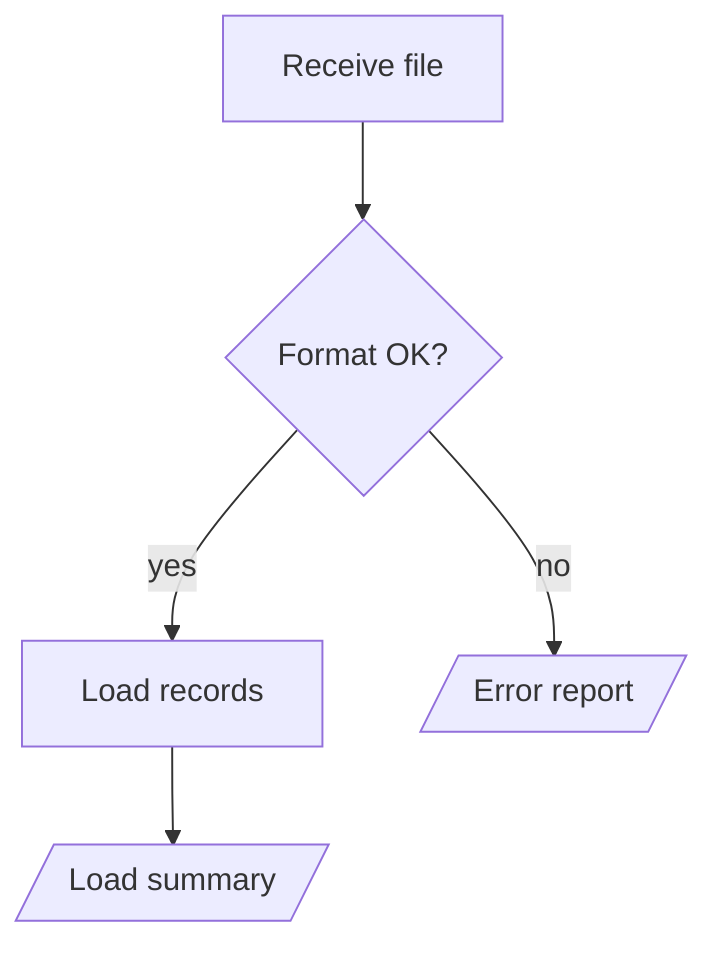
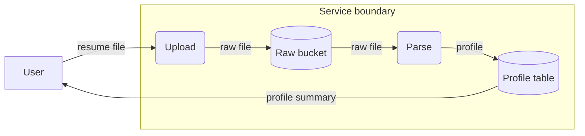
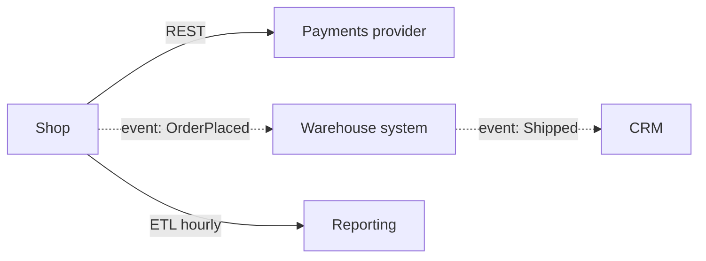

# Behaviour and flow views

Views of what happens at runtime: interactions, control flow, lifecycles, and movement of data.
Element names in the examples are placeholders; draw the names the design and the glossary use.

## Which one

| Type | Answers | Its neighbours, and the difference |
|---|---|---|
| Sequence diagram (UML) | Who sends what to whom, in what order, for one scenario | Time-ordered interaction between participants. Use activity for branching control flow, data flow for what data moves where. |
| Activity diagram (UML) | Which actions, decisions and parallel branches lead to which outcomes | Control flow with formal semantics: guarded decisions, merges, forks and joins, start and end. A flowchart is an activity diagram only when it carries those semantics. |
| State machine diagram (UML) | Which states one entity or process can be in and which events move it between them | About the lifecycle of ONE thing, not a sequence of steps. A state is a condition that persists; an action is not a state. |
| Workflow diagram | The steps, roles and handoffs of a business or operational workflow | Less formal than activity; organised by who does each step (swimlanes). |
| Process flow diagram | The sequence of steps in a process, with decisions and outputs | Like workflow without roles, and less formal than activity. Use activity when concurrency or precise guards matter. |
| Data flow diagram | Where data comes from, how it is transformed, where it is stored, where it goes | Movement of data, not order of execution and not structure. Arrows carry data names, not calls. |
| Integration diagram | How systems connect: APIs, events, files, messaging, ETL | Cross-system connections and their mechanisms. A sequence shows the order; an integration view shows the connections. |

Sequence vs activity vs state, in one line each: sequence = messages between participants over
time; activity = control flow through decisions and parallel work; state = the lifecycle of one
entity. When one view cannot answer both the interaction and the branching question, draw both
and link them.

## Sequence diagram (UML)

- **For:** one scenario end to end: the trigger, ordered calls and events, replies, and the
  alternative, error and retry paths the design contains.
- **Mermaid:** `sequenceDiagram`; `autonumber` so a table beside the diagram can carry message
  detail keyed by step number; `->>` synchronous call, `-->>` reply, `-)` asynchronous message;
  `alt`/`opt`/`loop`/`par` fragments; participants declared in reading order, with short
  aliases. Keep each message to a few words. An arrow may cross the lifelines between its two
  participants, but its label must not sit on one: order participants so that frequent partners
  are adjacent, and use `"messageAlign": "left"` (as below) so each label starts at its sender.

## Activity diagram (UML)

- **For:** a process with decisions, merges, parallel work and distinct outcomes (success,
  failure, cancellation).
- **Mermaid:** `flowchart TD` with activity semantics made explicit: start as a filled circle
  (`((start))`), end as a double circle (`(((end)))`), decisions as diamonds with labelled guard
  edges (`[valid]`, `[invalid]`), a separate merge diamond where branches rejoin, and a
  fork/join as a thin bar node (`fork[" "]` styled black). Label every loop's exit condition.

## State machine diagram (UML)

- **For:** the states of one entity or long-running process, its initial and terminal states,
  the events and guards that move it, and failure, retry and cancellation transitions.
- **Mermaid:** `stateDiagram-v2`; `[*]` for initial and final; transitions labelled
  `event [guard] / effect`, kept short; composite states for sub-lifecycles; `direction LR` when
  the main path is long. Several transitions into one `[*]` draw converging arrowheads on one
  point; when that overlaps, mark the other terminal states in the prose or a note instead (here
  Cancelled and Refunded are terminal).

## Workflow diagram

- **For:** a business or operational workflow: steps, who does each, and handoffs between roles.
- **Mermaid:** `flowchart LR`; one `subgraph` per role as a swimlane; edges that cross a lane
  boundary are the handoffs.

## Process flow diagram

- **For:** the ordered steps of a process with its decisions and outputs, without roles and
  without formal activity semantics.
- **Mermaid:** `flowchart TD`; rectangles for steps, diamonds for decisions, parallelogram
  (`[/output/]`) for outputs.

## Data flow diagram

- **For:** sources and sinks of data, the processes that transform it, the stores that hold it,
  and the trust boundaries it crosses (including sensitive data).
- **Not:** execution order. The arrows are data, labelled with data names.
- **Mermaid:** `flowchart LR`; external entities as rectangles, processes as rounded nodes
  (`(Normalise)`), stores as cylinders (`[(Store)]`), trust boundaries as `subgraph`s; each edge
  labelled with the data it carries.

## Integration diagram

- **For:** how systems connect and by which mechanism (REST, events, files, queues, ETL), with
  the direction of each connection.
- **Mermaid:** `flowchart LR`; systems as rectangles; the mechanism as the edge label (`REST`,
  `event: OrderPlaced`, `SFTP nightly`); dotted arrows for asynchronous mechanisms.

