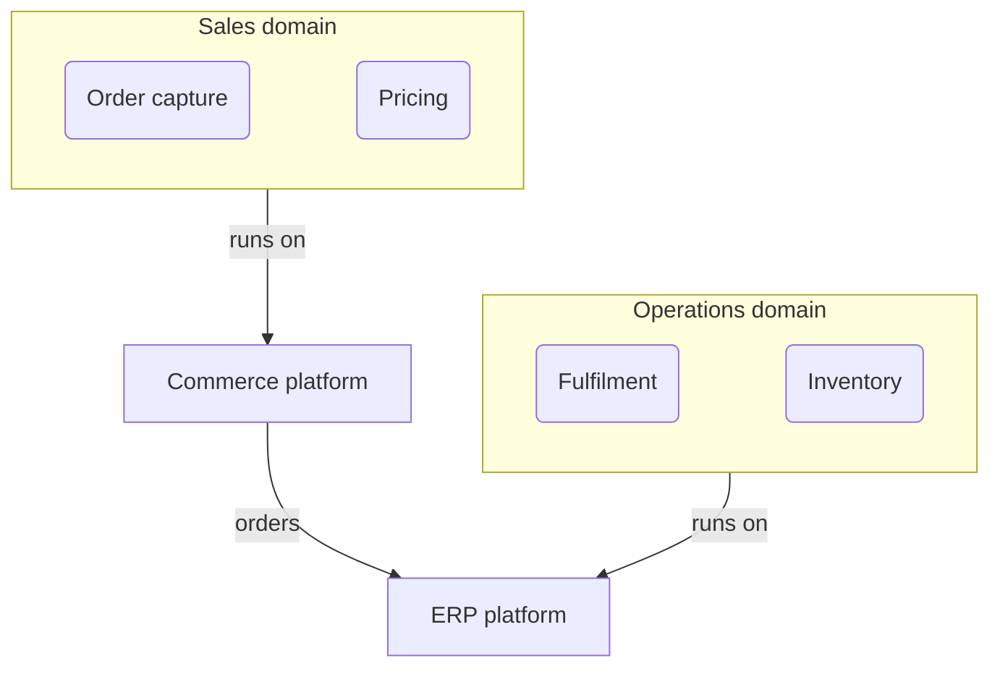
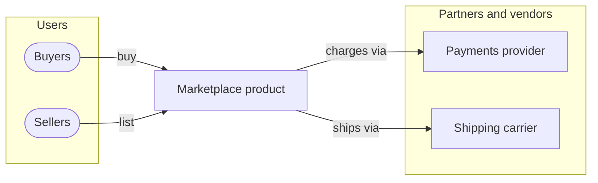
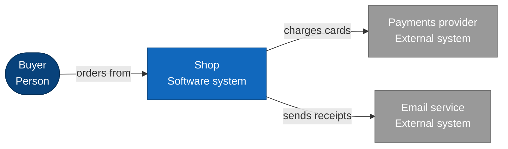
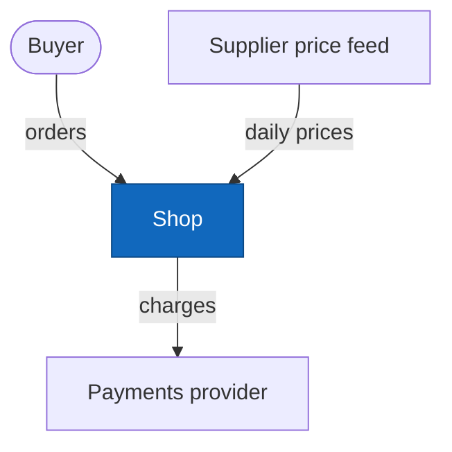
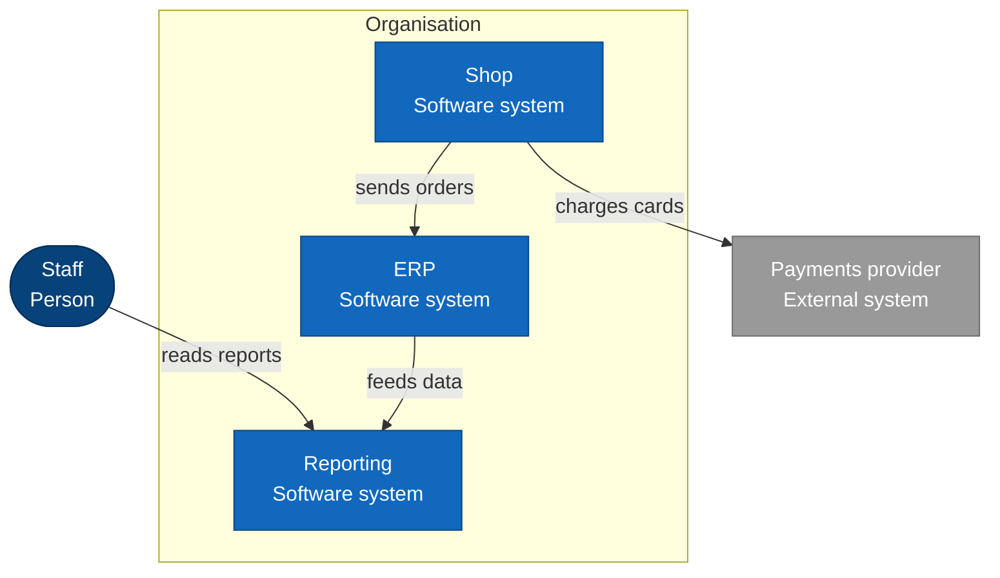
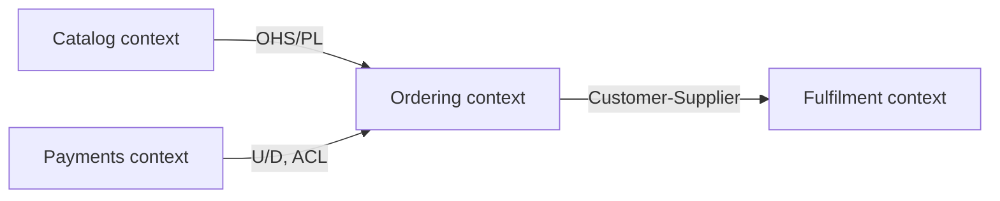

# Context and landscape views

Views that show what surrounds a system or what lies across many systems. Element names in the
examples are placeholders; draw the names the design and the glossary use.

## Which one

| Type | Scope it answers | Its neighbours, and the difference |
|---|---|---|
| Enterprise architecture diagram | The whole organisation: business domains, capabilities, major platforms | Broader than a landscape: organised by business capability, not by system. |
| Ecosystem view | One product or platform and everyone around it: partners, vendors, users, external platforms, internal dependencies | Less formal than a system context; it is for communication, and shows relationships a context diagram leaves out (commercial partners, channels). |
| System context diagram (C4 L1) | One system in scope, its people and the external systems it talks to | The formal C4 version of a context view. Nothing inside the system is shown. |
| Context diagram | What surrounds one system | Same question as system context, without the C4 notation. Prefer the C4 system context unless the reader needs something C4 does not admit. |
| Landscape diagram (C4 system landscape) | Several systems of one estate and how they relate | Several systems where a system context has one; still no internals. |
| Context map (DDD) | Bounded contexts and the integration relationship between each pair | Shows domain boundaries and team/model relationships (upstream/downstream, anti-corruption layer), not systems and people. It is not a C4 context. |

The project's list of view types has no `context map` row; the architecture documentation model
names it as a domain view. Declare a `view_type` only from the list: when asked for a context map,
report the missing list entry to whoever delegated the task instead of inventing a `view_type`.

## Enterprise architecture diagram

- **For:** the organisation-wide picture: business domains, the capabilities in each, the major
  platforms that realise them, and strategic relationships between them. Read by leadership and
  architects planning across products.
- **Choose it when:** the question spans products or domains ("which platform supports which
  capability?"). For one system, use a system context instead.
- **Mermaid:** `flowchart TB`; one `subgraph` per business domain; capabilities as rounded nodes,
  platforms as rectangles; edges only for strategic dependencies, labelled in a word or two.

## Ecosystem view

- **For:** the product in its environment: users, channels, partners, vendors, external platforms
  and internal dependencies, for product and platform conversations.
- **Choose it when:** the reader needs the commercial or organisational surroundings (who
  supplies, who distributes) rather than the technical boundary.
- **Mermaid:** `flowchart LR`; the product in the middle; one `subgraph` per kind of party
  (users, partners, vendors) so the groups spread around it.

## System context diagram (C4 Level 1)

- **For:** the boundary of one system: who uses it and which external systems it depends on or
  serves. The entry view of section 3.
- **Not:** a container view; no services, databases or queues inside the system appear here.
- **Mermaid:** `C4Context` (`Person`, `System`, `System_Ext`, `Rel(from, to, "label",
  "technology")`; syntax in the `c4-diagramming` skill), or the C4-notation `flowchart` below,
  which keeps labels off lines and boxes more reliably. Keep labels to a few words.

## Context diagram

- **For:** the same scope question as a system context, when C4 notation does not fit the reader
  or the elements (for example, a data source that is neither a person nor a system).
- **Mermaid:** `flowchart LR`; the system as one node in the middle, everything else around it;
  people as stadium shapes, external systems as rectangles, the system styled apart from them.

## Landscape diagram (C4 system landscape)

- **For:** several systems of one organisation or estate and how they relate, with their users.
- **Choose it when:** more than one system is in scope. For one system, use a system context.
- **Mermaid:** `C4Context` with an `Enterprise_Boundary` around the organisation's systems. With
  more than three or four relationships the C4 grid tends to run lines through boxes; then draw
  it as a C4-notation `flowchart`, as below: `classDef` for person, internal and external
  systems, the element kind on the second line of each label, and one `subgraph` for the
  enterprise boundary.

## Context map (DDD)

- **For:** the bounded contexts of a domain and how each pair integrates: upstream/downstream,
  customer-supplier, conformist, anti-corruption layer (ACL), open host service with published
  language (OHS/PL), shared kernel, partnership.
- **Not:** a system context. Contexts are model and language boundaries; one service can hold one
  context, and a context map says nothing about users or deployment.
- **Mermaid:** `flowchart LR`; one node per bounded context; each edge points downstream and is
  labelled with the relationship pattern only (`U/D ACL`, `OHS/PL`, `Shared kernel`). Explain
  each relationship in a table beside the map.

