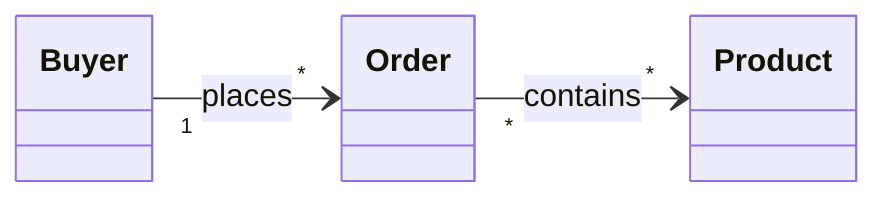
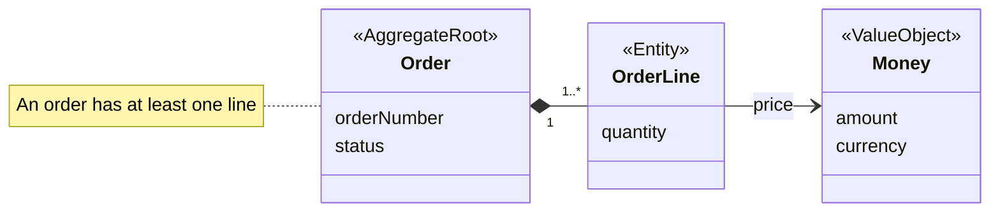
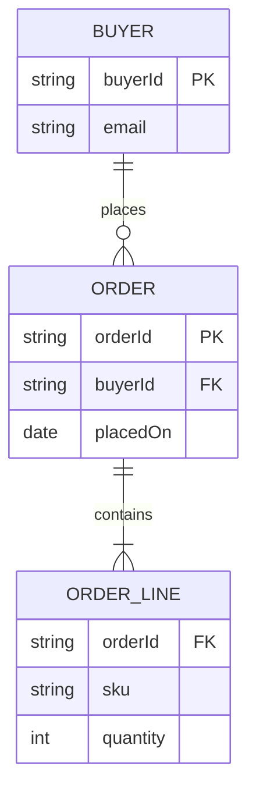
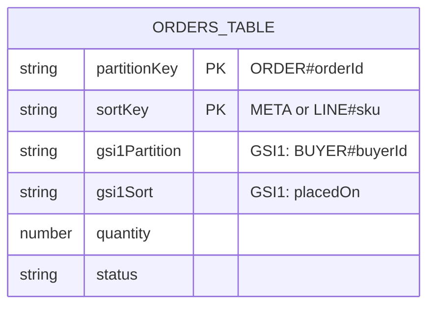
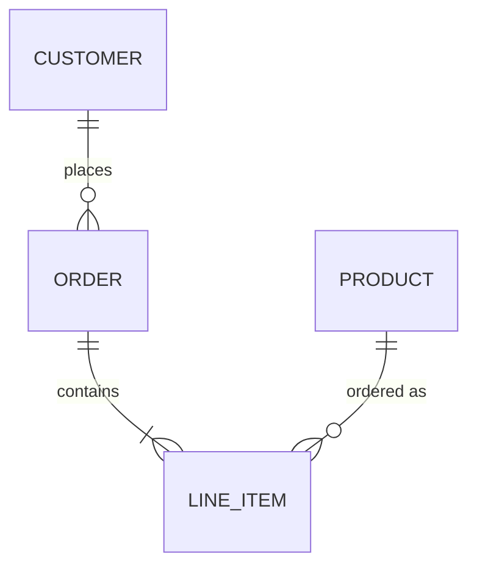

# Domain and data models

Views of what the business means and how data is shaped and stored. Element names in the
examples are placeholders; draw the names the design and the glossary use.

## Which one

| Type | Shows | Its neighbours, and the difference |
|---|---|---|
| Conceptual model | The core concepts of a domain and how they relate, nothing more | The earliest, loosest model: names and relationships only. It grows into a domain model or a logical data model. |
| Domain model | Entities, value objects, aggregates and their relationships, with the invariants that matter | Business meaning, not storage and not code. More precise than a conceptual model; less implementation-bound than a class diagram. |
| Logical data model | Entities, attributes, keys and relationships, independent of any database | Data design without a technology. Between conceptual and physical. |
| Physical data model | Tables, columns or attributes, types, keys and indexes for one data store | The implementation of a logical model in one technology (for DynamoDB: table, partition key, sort key, GSIs, item types). |
| Entity-relationship diagram | Entities and relationships with cardinality | A notation, not an abstraction level: an ERD can carry a logical or a physical model. Say which. |

A domain model and a class diagram can look alike: the domain model names business concepts and
rules; the class diagram adds operations and implementation types (see `types-structure.md`).
Keep a domain identity (an order number) distinct from a storage key (`PK = ORDER#123`).

## Conceptual model

- **For:** agreeing on the vocabulary of a domain early: which concepts exist and how they relate.
- **Mermaid:** `classDiagram` with empty classes (names only) and labelled associations.

## Domain model

- **For:** the concepts of one bounded context with their kind (entity, value object, aggregate
  root), key attributes, relationships with cardinality, and the invariants the design states.
- **Mermaid:** `classDiagram`; stereotypes `<<AggregateRoot>>`, `<<Entity>>`, `<<ValueObject>>`;
  only business attributes; invariants in a `note`.

## Logical data model

- **For:** the data entities, their attributes and keys, and the relationships, without a
  database technology.
- **Mermaid:** `erDiagram`; attributes with generic types (`string`, `int`, `date`); `PK`/`FK`
  markers; relationship labels of one or two words.

## Physical data model

- **For:** how the data is stored in one technology: tables, key schema, attribute types,
  indexes, and for a single-table design the item types sharing the table.
- **Mermaid:** `erDiagram` for relational stores (column types, `PK`, `FK`, `UK`). For DynamoDB,
  one `erDiagram` entity per table or per item type, with the partition and sort key attributes
  marked `PK` (an attribute name must not be `PK`, `FK` or `UK` in any letter case: those are
  reserved key markers), each GSI's key
  attributes with a comment naming the index, and a table beside the diagram listing access patterns and the key or index each
  uses.

## Entity-relationship diagram

- **For:** entities and relationships with cardinality, at the logical or physical level the
  view states.
- **Mermaid:** `erDiagram`; crow's-foot cardinality (`||--o{` one to zero-or-many, `||--|{` one
  to one-or-many, `|o--o|` zero-or-one on both sides); relationship label of one or two words;
  attributes only when they explain the relationship.

