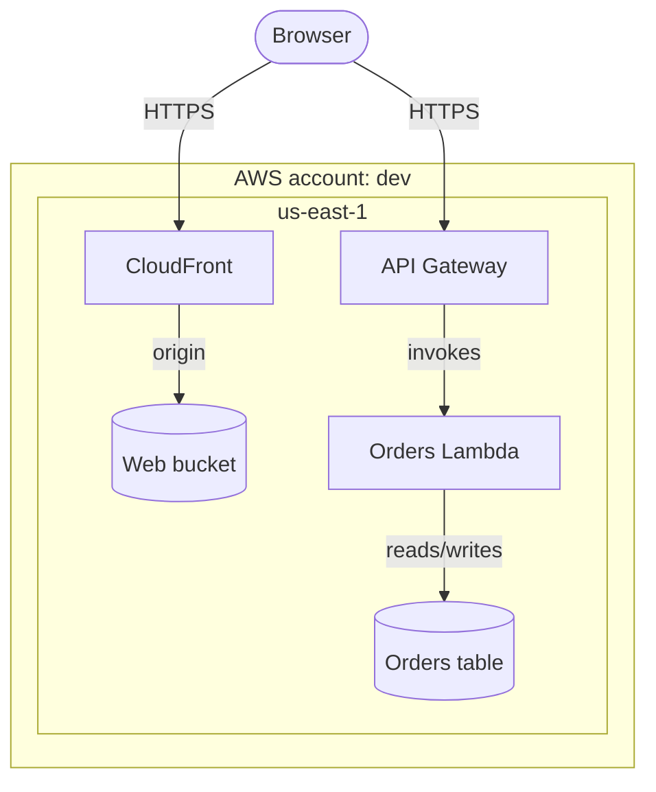
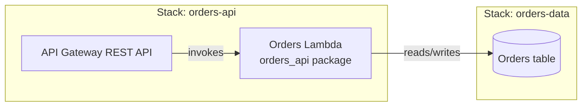
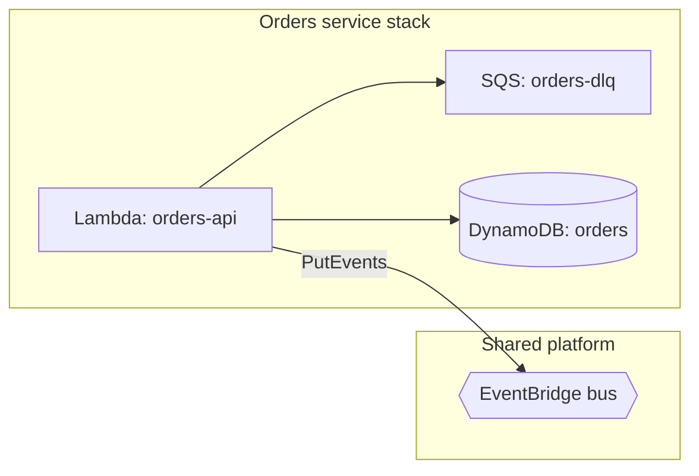
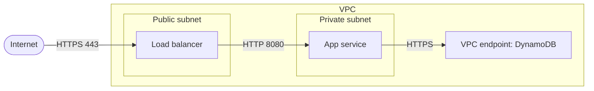
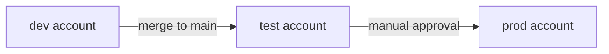

# Deployment, infrastructure and network views

Views of where the software runs and how it can communicate. Show only resources and
environments the version being described supports; never present a target resource as observed.
Element names in the examples are placeholders; draw the names the design and the glossary use.

## Which one

| Type | Shows | Its neighbours, and the difference |
|---|---|---|
| Physical architecture diagram | The real deployed topology: accounts, regions, compute, storage, networks | Counterpart of the logical architecture view: the same responsibilities, now placed on infrastructure. |
| Deployment diagram (C4 / UML) | Which software (containers, functions, artifacts) runs on which node or cloud resource | Maps software to infrastructure. Infrastructure without the software mapping is an infrastructure view. |
| Infrastructure diagram | Cloud services and platform resources: functions, tables, queues, buckets, gateways, stacks | Operational and platform-focused; resources and their owners (stacks), not the software-to-node mapping. |
| Network diagram | VPCs, subnets, routing, gateways, endpoints, trust zones, ingress and egress | A narrow view of reachability: which path a packet can take. Not which code runs where. |
| Environment diagram | The environments (dev, test, prod) that exist, how they differ, and how changes are promoted | About environments and promotion, not about the topology inside one environment. |

Deployment vs infrastructure vs network, in one line each: deployment = which software runs on
which node; infrastructure = which resources exist and who owns them; network = which paths
between them are allowed.

## Physical architecture diagram

- **For:** the deployed topology as a whole, so the logical view can be read against it.
- **Mermaid:** `flowchart TB`; nested `subgraph`s for account, region and, where relevant, VPC;
  resources as nodes inside them; edges labelled with the connection.

## Deployment diagram (C4 / UML)

- **For:** the mapping of software onto nodes: which container, function or artifact is deployed
  to which resource, in which stack.
- **Mermaid:** `C4Deployment` with `Deployment_Node` nesting and the containers inside, or
  `flowchart LR` with one `subgraph` per node or stack, side by side, and the software as nodes inside.

## Infrastructure diagram

- **For:** the platform resources a system uses, grouped by owning stack, with the shared
  resources separated from service-owned ones.
- **Mermaid:** `flowchart LR`; one `subgraph` per stack or owner; a separate `subgraph` for shared
  resources; resource type in the label (`Lambda`, `SQS`, `DynamoDB`).

## Network diagram

- **For:** trust zones and reachability: public and private subnets, gateways, VPC endpoints,
  ingress and egress paths, and the protocol on each permitted path.
- **Mermaid:** `flowchart LR`; nested `subgraph`s for VPC and subnets (the trust zones); edges
  labelled with protocol/port; keep DNS, routing and reachability distinct.

## Environment diagram

- **For:** which environments exist, what differs between them, and how a change is promoted.
  Draw only environments that exist in the version described.
- **Mermaid:** `flowchart LR`; one node per environment; promotion arrows labelled with the
  trigger; differences in a table beside the diagram.

