# Structure views

Views of what a system is made of: deployable units, services, layers, components, modules and
code. Element names in the examples are placeholders; draw the names the design and the glossary
use.

## Which one

| Type | Shows | Its neighbours, and the difference |
|---|---|---|
| Container diagram (C4 L2) | The runnable or deployable units of one system (web app, API, function, database, queue) and how they talk | Decomposes the system context. Software building blocks, not infrastructure: a database is a container, the server it runs on is not. |
| Service diagram | Services and their APIs, events and dependencies | Same level as a container view, but only the services and their contracts; use it when the question is "which service depends on which, sync or async". Do not draw it as a copy of the container view. |
| Application diagram | One or more applications and how they relate | A generic name. Use a container, landscape or integration view when one of them fits the question; use this only for a loose overview that none of them matches. |
| 3-tier architecture diagram | Presentation, business logic and data layers | A special case of N-tier with exactly three layers. |
| N-tier architecture diagram | The logical layers of a system and the allowed dependency direction between them | Shows layers, not units; draw it only when the layers are real and explain dependency rules. |
| Logical architecture diagram | Responsibilities and their dependencies, independent of deployment | Counterpart of the physical architecture view. Can use container or component shapes, but never names hosts, accounts or regions. |
| Subsystem diagram | The major partitions inside one system, coarser than components | Sits between container and component; use it when a system has internal partitions that are not separately deployable. |
| Component diagram (C4 L3 / UML) | The parts inside one container or service, their responsibilities and interfaces | Inside one container only. UML component views also show provided/required interfaces. |
| Module diagram | Code decomposition into modules or libraries and their dependencies | More implementation-oriented than a component view: the unit is a code module, not a runtime responsibility. |
| Package diagram (UML) | Packages or namespaces and the dependencies between them | Like a module view, but in UML package notation and often for a model rather than code. |
| Code diagram (C4 L4) | Classes, interfaces and methods of one component | Rarely drawn by hand; use a class diagram for it. |
| Class diagram (UML) | Classes, attributes, operations, inheritance and associations | More implementation-oriented than a domain model. |
| Object diagram (UML) | Example instances and their links at one moment | The instance-level counterpart of a class diagram; use it to explain a tricky structure with a concrete example. |

Container, service and integration views overlap. Draw the one whose question the reader is
asking at the declared scope; never three copies of one graph under different names.

## Container diagram (C4 Level 2)

- **For:** the deployable/runnable units inside one system, their technology, and how they
  communicate. The highest-scope structural view of section 5 at system scope.
- **Mermaid:** `C4Container` (`System_Boundary`, `Container`, `ContainerDb`, `ContainerQueue`,
  `System_Ext`, `Rel(from, to, "verb", "technology")`; syntax in the `c4-diagramming` skill) for a
  small view, or the C4-notation `flowchart` below, which lays out more cleanly: the system
  boundary as a `subgraph`, the container kind and technology on the second line of each label,
  dotted arrows for asynchronous links.

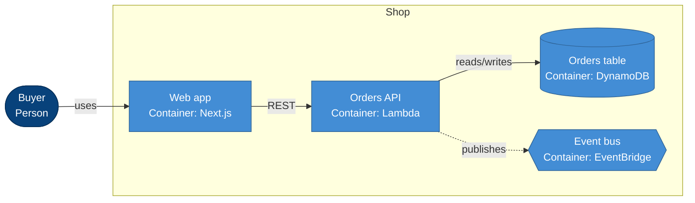

## Service diagram

- **For:** services, the APIs and events between them, and which link is synchronous or
  asynchronous.
- **Mermaid:** `flowchart LR`; services as rectangles, the event bus as a hexagon; solid arrows
  for synchronous calls, dotted arrows (`-.->`) for asynchronous events; a legend line in the
  prose.

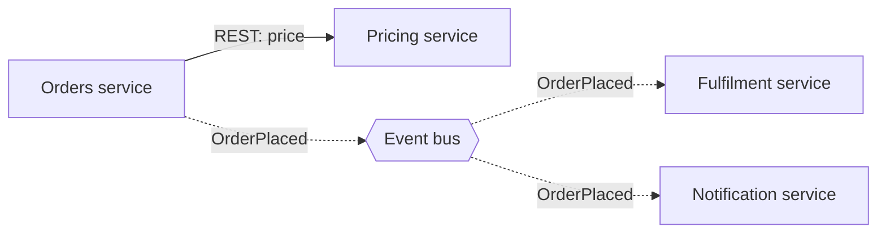

## Application diagram

- **For:** a loose overview of applications and how they communicate, when no more specific type
  fits.
- **Mermaid:** `flowchart LR`; one node per application, labelled edges.

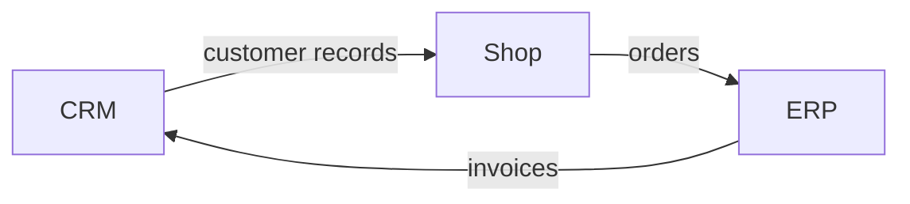

## 3-tier architecture diagram

- **For:** a system split into presentation, logic and data, with each tier calling only the
  next.
- **Mermaid:** `flowchart TB`; one `subgraph` per tier, top to bottom; edges only between
  adjacent tiers.

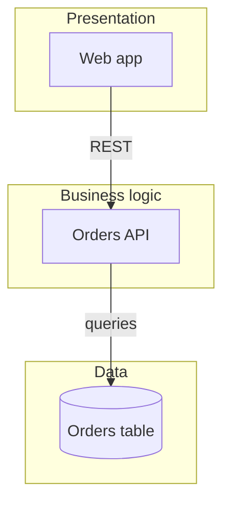

## N-tier architecture diagram

- **For:** a system with more than three logical layers and the rule of which layer may depend on
  which.
- **Mermaid:** `flowchart TB`; one `subgraph` per layer in dependency order; one arrow per allowed
  dependency, between layers rather than between every node.

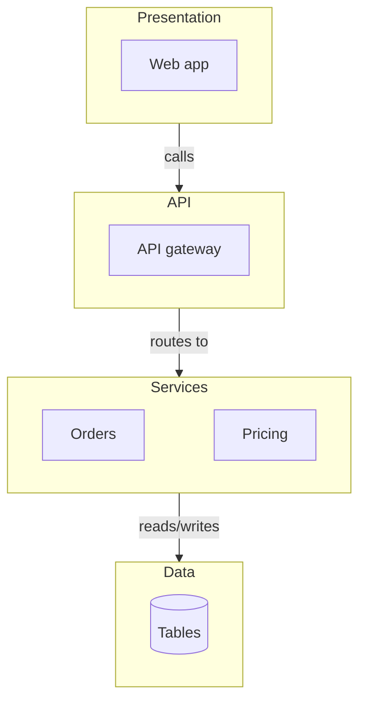

## Logical architecture diagram

- **For:** what the system is responsible for and how those responsibilities depend on each
  other, without saying where anything runs.
- **Mermaid:** `flowchart LR`; responsibilities as rounded nodes, grouped by domain in
  `subgraph`s; no AWS resource names, accounts or regions.

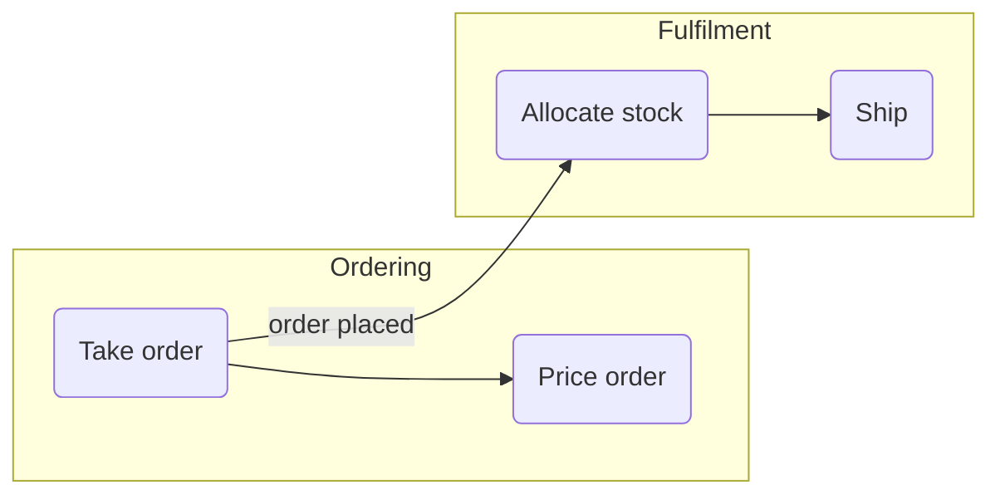

## Subsystem diagram

- **For:** the major internal partitions of one system that are coarser than components and not
  separately deployable.
- **Mermaid:** `flowchart LR`; one `subgraph` per subsystem with its two or three main parts;
  edges between subsystems. Lay subsystems side by side so edges do not cross subgraph titles.

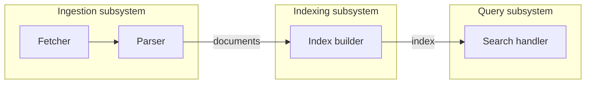

## Component diagram (C4 Level 3 / UML)

- **For:** the parts inside one container or service, each part's responsibility, and the
  interfaces between them.
- **C4 vs UML:** a C4 component view sits inside one container from the container view and uses
  C4 shapes; a UML component view adds provided/required interfaces. Pick the one the reader's
  question needs.
- **Mermaid:** `C4Component` inside a `Container_Boundary` (syntax in the `c4-diagramming`
  skill), or the C4-notation `flowchart LR` below: a `subgraph` for the container boundary,
  component kind and technology on the second line, and for a UML view the interfaces as small
  circle nodes.

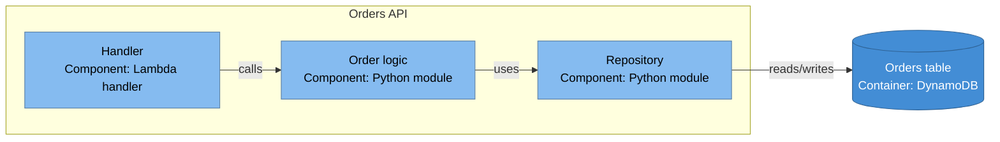

## Module diagram

- **For:** how code is split into modules or libraries and which imports which.
- **Mermaid:** `flowchart TB`; modules as rectangles; dotted arrows labelled `imports`; layers of
  modules top to bottom so dependencies point down.

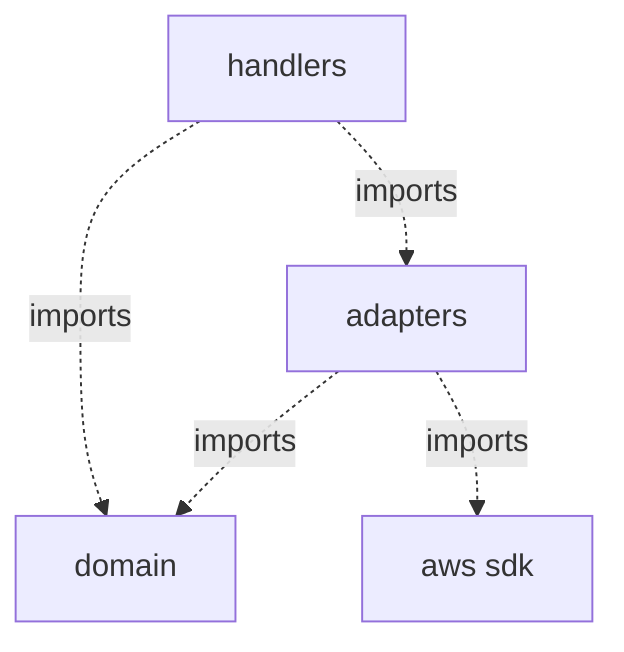

## Package diagram (UML)

- **For:** packages or namespaces of a model or codebase and the dependencies between them.
- **Mermaid:** `flowchart TB`; one `subgraph` per package holding its main elements; dotted
  dependency arrows between packages, labelled `uses` or `imports`.

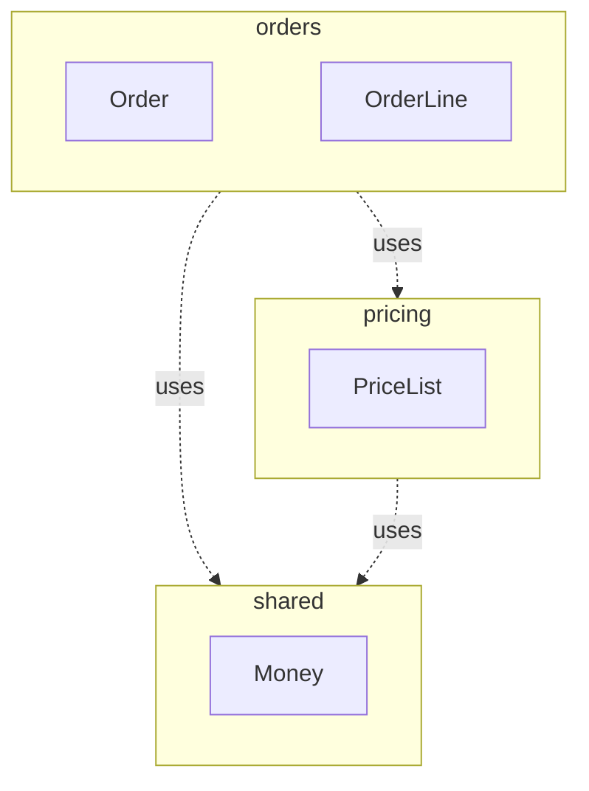

## Code diagram (C4 Level 4)

- **For:** the classes and interfaces that implement one component. Draw it only when asked;
  code changes faster than the drawing.
- **Mermaid:** `classDiagram` limited to the classes of one component; see the class diagram.

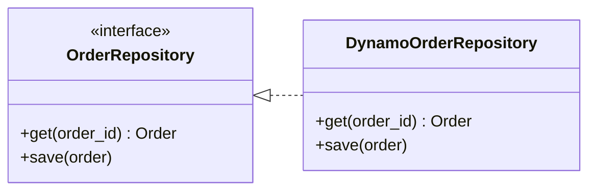

## Class diagram (UML)

- **For:** static object-oriented structure: classes, attributes, operations, inheritance,
  associations with multiplicities.
- **Not:** a domain model. A domain model names business concepts; a class diagram may add
  implementation types and operations.
- **Mermaid:** `classDiagram`; `direction LR` for wide hierarchies; show only the members that
  explain the structure; multiplicities on associations.

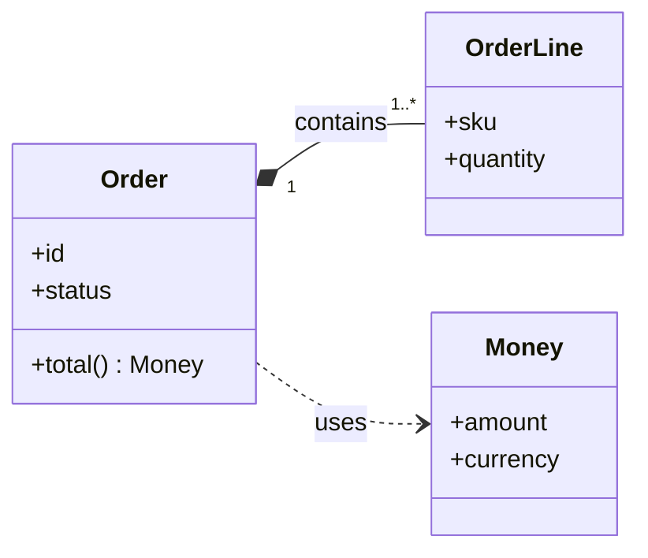

## Object diagram (UML)

- **For:** one concrete snapshot of instances and their links, to explain a structure by example.
- **Mermaid:** Mermaid has no object diagram kind. Use `classDiagram` with instance labels
  (`class o1["order42 : Order"]`) and attribute values as members; say in the prose that the
  boxes are instances.

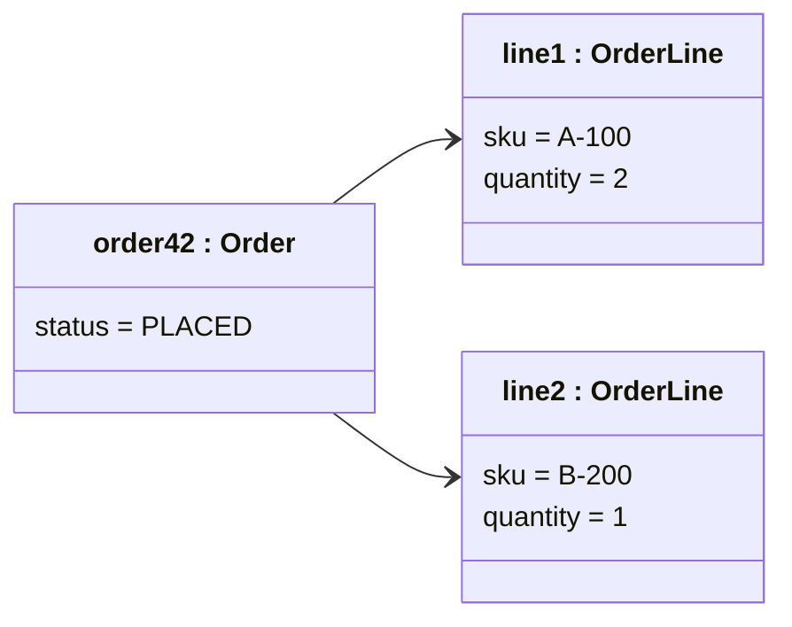
