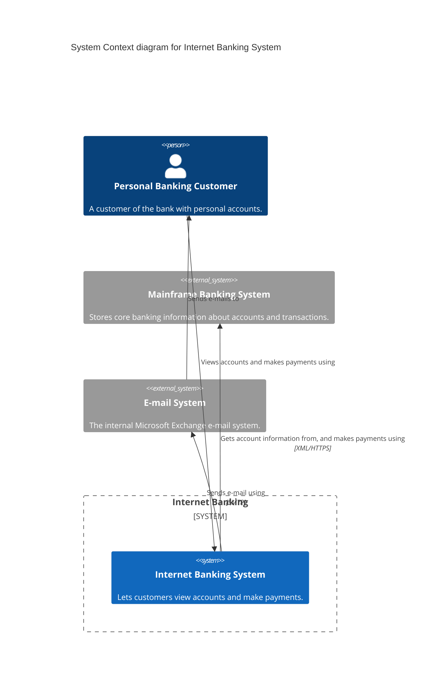
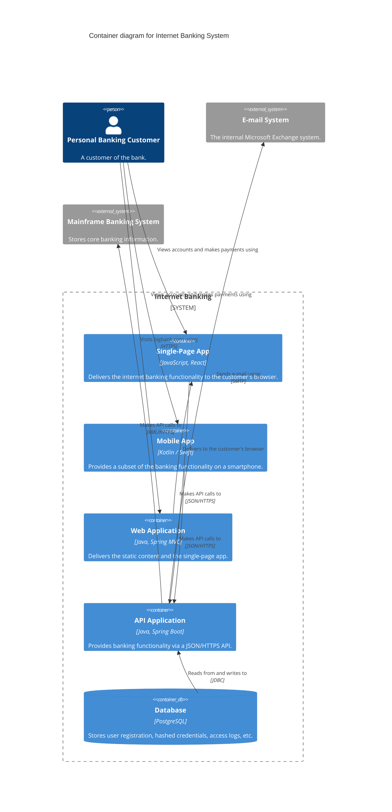
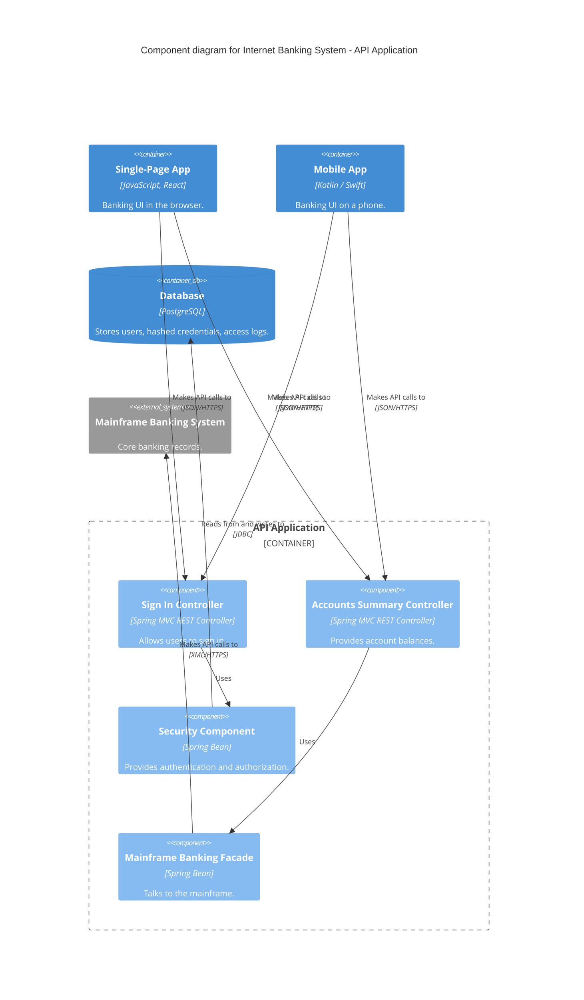
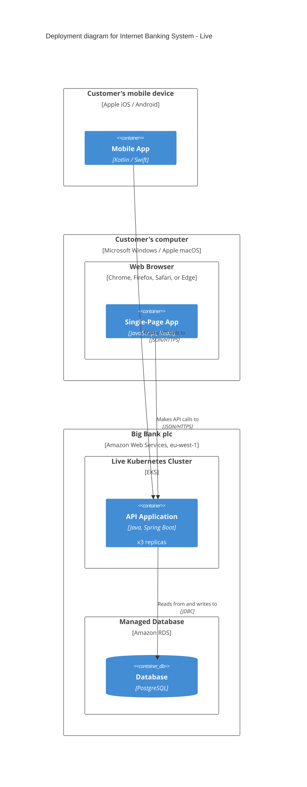

# Mermaid C4 syntax — runnable examples

Mermaid ships experimental support for C4 diagrams. The diagram kind is declared on the
first line: `C4Context`, `C4Container`, `C4Component`, `C4Dynamic`, or `C4Deployment`.
This file is the canonical place for fenced Mermaid examples in this skill — copy a block,
rename the elements, and adjust relationships.

## Element vocabulary (shared across all C4 kinds)

- `Person(alias, "Label", "Optional description")` — an internal person/actor.
- `Person_Ext(alias, "Label", "Description")` — an external person.
- `System(alias, "Label", "Description")` — your software system (Level 1 focus).
- `System_Ext(alias, "Label", "Description")` — an external software system.
- `SystemDb(alias, ...)`, `SystemQueue(alias, ...)` — system shaped as a datastore / queue.
- `Container(alias, "Label", "Technology", "Description")` — a deployable/runnable unit.
- `ContainerDb(alias, "Label", "Technology", "Description")` — a container that is a datastore.
- `ContainerQueue(alias, ...)` — a container that is a message queue.
- `Component(alias, "Label", "Technology", "Description")` — a component inside a container.
- `ComponentDb(...)`, `ComponentQueue(...)` — datastore/queue-shaped components.
- Boundaries: `Enterprise_Boundary(alias, "Label") { ... }`,
  `System_Boundary(alias, "Label") { ... }`,
  `Container_Boundary(alias, "Label") { ... }`.
- Relationships: `Rel(from, to, "Label", "Optional technology/protocol")`. Directional
  variants control layout: `Rel_U`/`Rel_Up`, `Rel_D`/`Rel_Down`, `Rel_L`/`Rel_Left`,
  `Rel_R`/`Rel_Right`, plus `BiRel` for bidirectional.
- Layout tuning: `UpdateLayoutConfig($c4ShapeInRow="3", $c4BoundaryInRow="1")` and
  per-element `UpdateElementStyle(alias, $bgColor="...", ...)`.

---

## Level 1 — System Context (`C4Context`)

An internet banking system used by a personal customer, which sends email and authorizes
payments through external systems.

---

## Level 2 — Container (`C4Container`)

Zooming into the Internet Banking System to show its deployable/runnable containers.

---

## Level 3 — Component (`C4Component`)

Zooming into a single container — the API Application — to show its components.

---

## Deployment view (`C4Deployment`) — optional, for arc42 section 7

Maps containers onto the infrastructure nodes that run them.

---

## Authoring notes

- The first non-blank line **must** be the diagram kind (`C4Context`, etc.); no leading
  whitespace before it.
- `title` is optional but recommended — it becomes the diagram caption.
- Define elements first, then relationships. Forward references in `Rel(...)` to an
  element defined later in the same block are tolerated, but defining first reads better.
- Layout for the C4 kinds is auto-managed. Do not fight it with manual coordinates; steer
  with `UpdateLayoutConfig`, the directional `Rel_U/D/L/R` variants, and `UpdateRelStyle`
  offsets instead.
- Keep each diagram to one C4 level. If a diagram needs both containers and their internal
  components to make sense, split it into a Container diagram plus one Component diagram.
