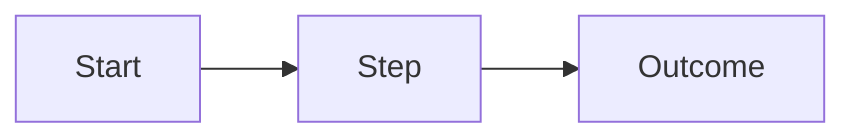

# Feature PRD: [Feature Name]

<!--
  Note: Delete all comments before saving of committing in git.

File naming: Use a slugified, groupable name.

Pattern: [domain]-[area]-[feature].md

Not: "search.md"

But: "opportunities-page-table-search.md"

Names should sort and group naturally when listed alphabetically.

-->

**Last Updated:** YYYY-MM-DD

## Document Hierarchy

<!--
  BRD > PRD > Spec > Epic > Issue > PR
  This document is a PRD. It defines WHAT a feature does, not HOW.
  Specs (one per repo) are derived from this document.
  Issues and PRs are derived from Specs.
-->

---

## Feature Description

<!--
  One sentence max. Adds enough context to make the title unambiguous.
  If the title is "Login Page", the description might be:
  "Create a React login form component with Google OAuth and email/password authentication."
-->

[One sentence description.]

---

## Feature Scope

<!--
  A feature is a single, verifiable change that an agent can complete
  in one session without losing coherence.

  Rules:
  1. One specific outcome. If you need "and" to describe it, it's two features.
  2. One file or a small set of tightly coupled files. If changes scatter
     across unrelated parts of the codebase, decompose.
  3. 100-300 lines of change. Under 100 is a bug fix or chore. Over 300
     means the agent will start losing track.
  4. Completable in a single think-plan-act-verify loop. If the agent needs
     to context-switch or reload state, the feature is too big.
  5. Has a pass/fail verification — a test, a linter check, a compilation,
     a behavioral assertion. If you can't verify it mechanically, it isn't
     defined well enough.
  6. Explicitly states what it excludes. Scope grows silently without an
     out-of-scope list.

  Smell tests for "too big":
  - Requires reasoning about more than one bounded context
  - Introduces multiple new entities or state changes simultaneously
  - The out-of-scope list is longer than the requirements
  - You can't write the acceptance criteria in under 5 assertions

  If any smell test triggers, decompose into multiple PRDs.

-->

---

## Problem

<!--
  1-2 sentences. State the problem from the user's perspective.
  Describe the PROBLEM, not the absence of a solution.
  Good: "Users cannot tell whether their data was processed successfully or silently dropped."
  Bad: "Users need a status dashboard."
-->

### Evidence

<!--
  Data points, observations, or references that validate this problem exists.
  Can be usage data, support tickets, user quotes, links to research, or your own experience.
  Delete this section if the problem is self-evident from the codebase.
-->

---

## Target Use Cases

<!--
  Who hits this problem and what are they trying to do when they hit it?
  Prioritize by frequency — most common first. 3-5 use cases max.
  Stay at the behavioral level, not the solution level.
-->

1. As a [user type], I want to [goal] so that [reason].
2. As a [user type], I want to [goal] so that [reason].
3. As a [user type], I want to [goal] so that [reason].

---

## Current Experience

<!--
  What happens today? Describe the current journey, failure mode, or gap.
  Use a flow if it helps:
    [step] > [step] > [failure point] > [consequence]
  Include screenshots, diagrams, or links to recordings if available.
-->

---

## Proposed Solution

<!--
  1-2 sentence summary of what the new experience should be.
  Concrete enough to evaluate, abstract enough to leave room for implementation.
  Good: "Expose a unified event stream that external modules can subscribe to without modifying core code."
  Bad: "Add EventBridge with DynamoDB Streams and a Lambda fan-out."
-->

---

## Goals

<!--
  What specific outcomes does this solution achieve?
  Tie each goal back to the problem statement.
-->

1. [Goal]
2. [Goal]
3. [Goal]

---

## Out of Scope

<!--
  What this feature intentionally does NOT cover.
  Be specific. Link to related features or future work where applicable.
  If this list is longer than the requirements, the feature is too big.
-->

- [Item] — [brief reason or "covered by [link]"]
- [Item]

---

## Requirements

### Priority Legend

- **P0** — Must ship for the feature to be considered complete
- **P1** — Important for a quality experience, can follow shortly after P0
- **P2** — Nice-to-have, acceptable to defer

### [Use Case or Capability Group]

<!--
  Group requirements by use case or logical capability area.
  Each requirement states WHAT the system must do, not HOW.
  Every P0 requirement MUST have acceptance criteria.
  P1/P2 acceptance criteria are recommended but optional.

  Technical features like observability or extensibility are described
  by their observable behavior, not their implementation.
  Good: "The system must allow new data sources to be added without
        modifying or redeploying existing components."
  Bad: "Implement a plugin registry with dynamic class loading."
-->

#### [Requirement Title]

**Priority:** P0 | P1 | P2

[Description of the required behavior.]

**Acceptance Criteria:**

<!--
  Testable conditions. Use Given/When/Then or simple assertions.
  Each criterion must be verifiable as pass/fail.
  If you can't write the acceptance criteria in under 5 assertions,
  the feature is too big — decompose.
-->

- Given [precondition], when [action], then [expected outcome].
- Given [precondition], when [action], then [expected outcome].
- [Simple boolean assertion if Given/When/Then is overkill.]

---

## Constraints

<!--
  Behavioral boundaries that limit the solution space.
  These are non-negotiable properties of the feature, not implementation choices.

  Good: "Must not require service downtime to add a new plugin."
  Good: "Must work without network access after initial load."
  Bad: "Use WebSockets for real-time updates."
-->

- [Constraint]
- [Constraint]

---

## Dependencies

<!--
  What must exist, be built, or be true before this feature can work?
  Include other features, services, data, third-party APIs, or infrastructure.
  Note whether each dependency exists today or is blocked.
-->

| Dependency | Status                         | Notes    |
| ---------- | ------------------------------ | -------- |
| [Name]     | Exists / Blocked / In Progress | [Detail] |

---

## Measurable Outcomes

<!--
  How will you know this feature is working?
  Define what you'd measure, the current baseline (if known), and the target.
  Acceptable measures: adoption rate, error rate reduction, task completion time,
  user satisfaction signal, operational metric, etc.
-->

| Metric             | Baseline                     | Target | Method         |
| ------------------ | ---------------------------- | ------ | -------------- |
| [What you measure] | [Current value or "unknown"] | [Goal] | [How measured] |

---

## Risks & Open Questions

<!--
  Unknowns that need resolution before or during build.
  Flag anything where the wrong assumption could invalidate the approach.
-->

- **[Risk/Question]:** [Context. What needs to be true, or what could go wrong.]
- **[Risk/Question]:** [Context.]

---

## Visual References

<!--
  Diagrams, wireframes, scope boundaries, flow charts, screen mockups.
  Embed as Mermaid blocks, markdown image links, or describe what to draw.
  These communicate WHAT the user sees or WHAT the system does — not HOW it's built.
-->

<!--  -->

---

## Definition of Done

<!--
  Feature-level completion gate. When all of these statements are true,
  the feature is shippable. Distinct from per-requirement acceptance criteria.
-->

- All P0 acceptance criteria are met.
- All constraints in this document are satisfied.
- Manual or automated verification is complete and passing.