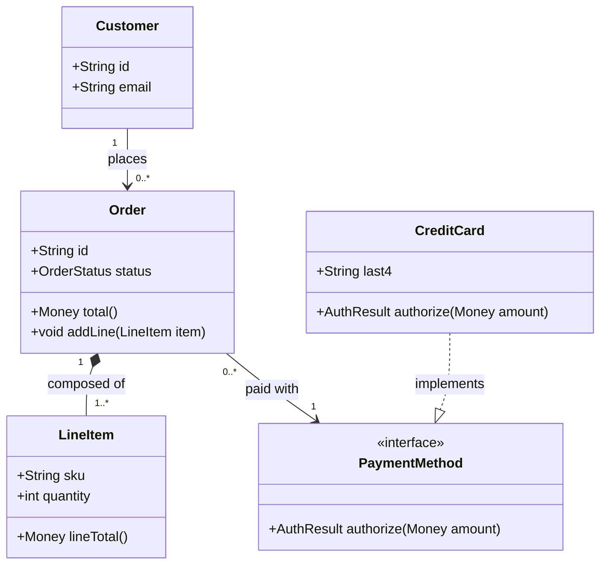
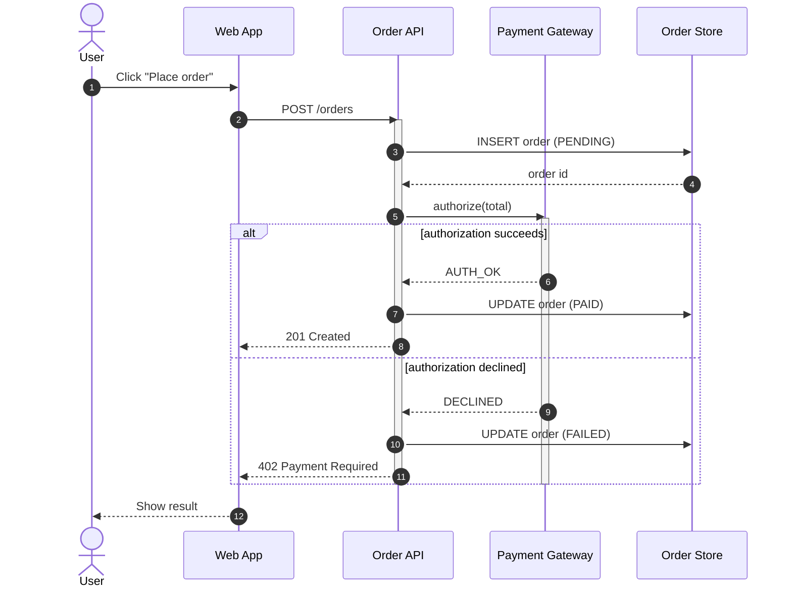
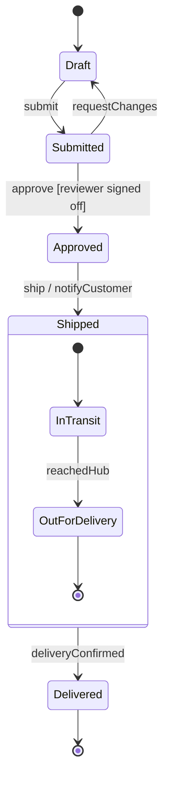
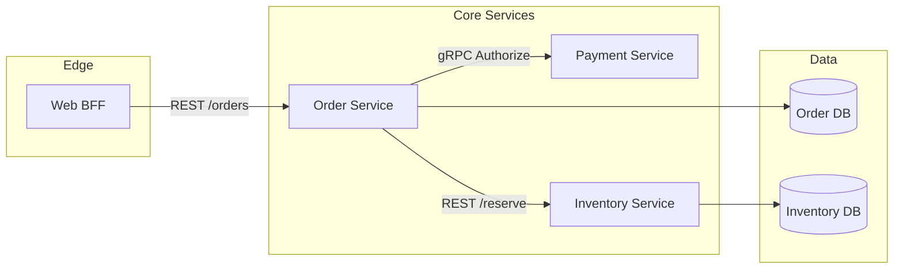
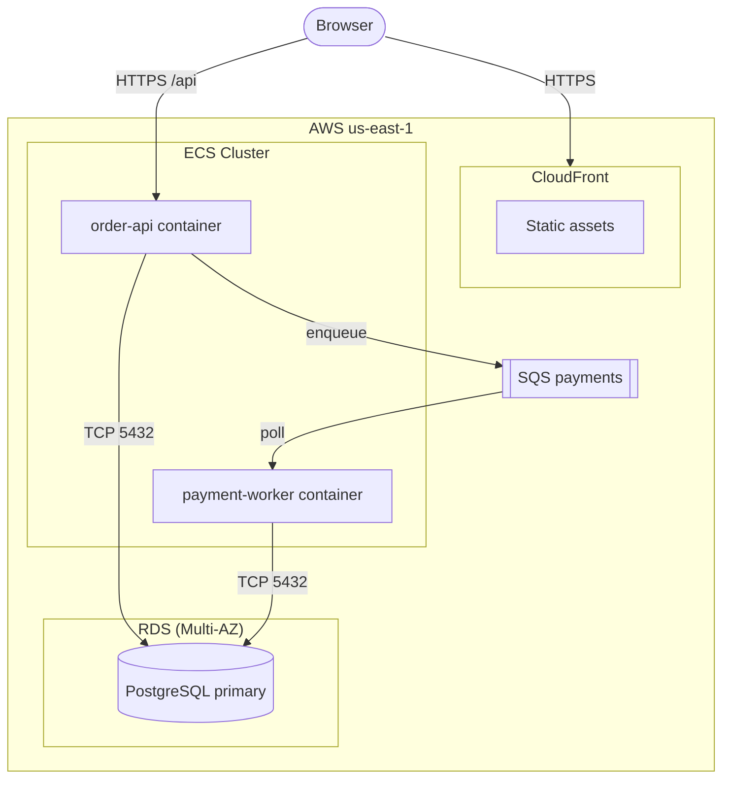

# Mermaid UML syntax — copy-ready examples

This is the only file in the skill that may contain ` ```mermaid ` code fences. Every example below renders as-is in GitHub Markdown and in Docusaurus (with `@docusaurus/theme-mermaid` enabled). Adapt the closest example to the domain at hand; keep each diagram focused on one question.

Mermaid has native grammars for **class**, **sequence**, and **state** diagrams. It has *no* native UML grammar for **component** and **deployment** diagrams, so those are approximated with `flowchart` plus `subgraph` boundaries — the conventions below keep those approximations consistent.

---

## Class diagram — `classDiagram`



Notation reference:
- `+` public, `-` private, `#` protected, `~` package on members.
- `-->` association, `*--` composition (filled diamond), `o--` aggregation (hollow diamond), `--|>` inheritance, `..|>` realization (implements an interface), `..>` dependency.
- `"1"` / `"0..*"` / `"1..*"` on the ends are multiplicities.
- `<<interface>>` / `<<abstract>>` / `<<enumeration>>` are stereotypes.

---

## Sequence diagram — `sequenceDiagram`



Notation reference:
- `->>` synchronous message, `-->>` reply/return, `-)` asynchronous message.
- `activate` / `deactivate` (or `+`/`-` suffixes) draw activation bars.
- `alt`/`else`, `opt`, `loop`, `par`/`and`, `critical` are combined fragments.
- `actor` draws a stick figure; `participant ... as ...` aliases a long name.
- `autonumber` numbers the messages.

---

## State diagram — `stateDiagram-v2`

Use the `-v2` grammar; it is the maintained variant.



Notation reference:
- `[*]` is both the initial and final pseudostate (position determines which).
- Transition labels read `event [guard] / action`.
- A nested `state Name { ... }` block models a composite (sub-)state.
- Use `--` inside a composite block to separate concurrent regions when a state has orthogonal parts.

---

## Component diagram — `flowchart` approximation

Mermaid has no UML component grammar. Approximate it with a `flowchart`: one node per component, `subgraph` for a system or deployment boundary, and edges labeled with the interface or protocol. Represent provided/required interfaces as labeled edges.



Conventions for this repo:
- `subgraph` = a system, subsystem, or boundary; give it a quoted label when it has spaces.
- `[Name]` = a component/service; `[(Name)]` = a datastore; `([Name])` = an external actor or queue.
- Label every edge with the interface or protocol it carries (`REST /path`, `gRPC Method`, `publishes Event`).

---

## Deployment diagram — `flowchart` approximation

Same approach, but `subgraph` represents a **node** (host, VM, container, region) and the nodes inside are the **artifacts** that run there. Label edges with the network protocol.



Conventions for this repo:
- Outer `subgraph` = a region or account; inner `subgraph` = a node (cluster, host, managed service).
- `[(...)]` = database, `[[...]]` = queue/topic, `([...])` = external client.
- Label every edge with the protocol and port where relevant (`HTTPS`, `TCP 5432`, `gRPC`).

---

## Rendering note

If a diagram fails to render, the cause is almost always a syntax slip: an unquoted label containing spaces or parentheses, a reserved word used as a node id, or the legacy `stateDiagram` keyword instead of `stateDiagram-v2`. Wrap any label with special characters in double quotes.
