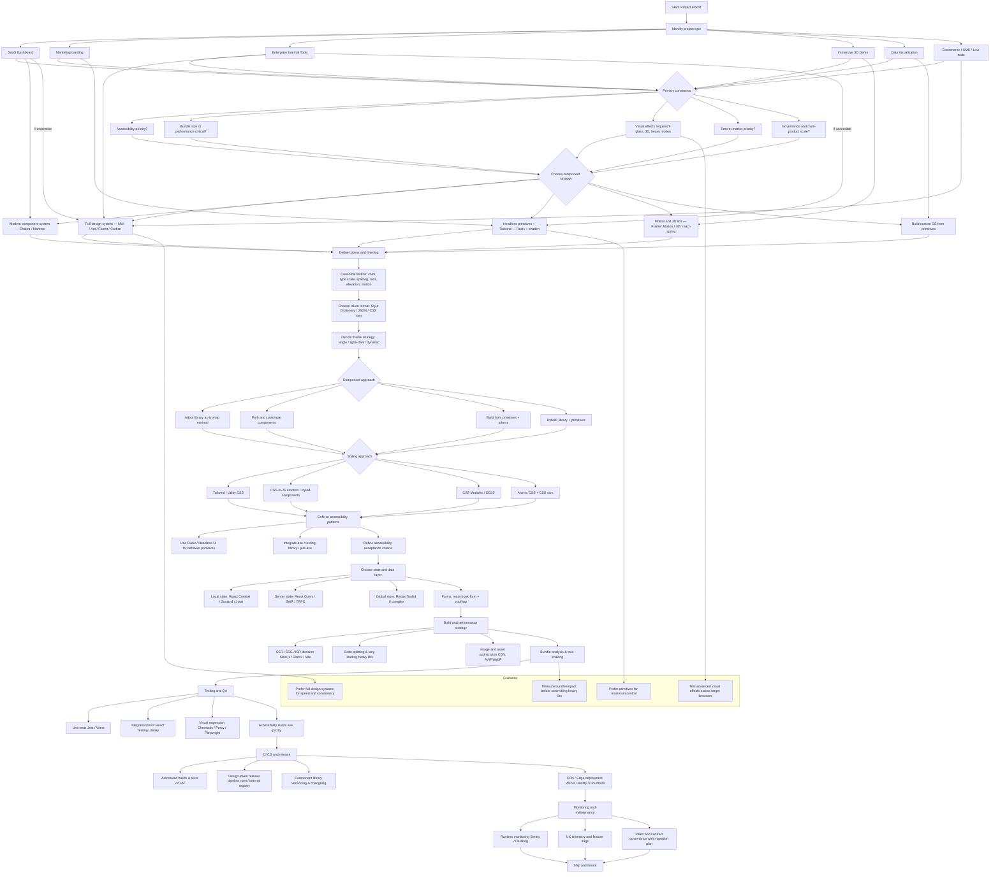

# Stack Selection & Architecture Guide

Decision framework for choosing tech stacks, design tokens, component strategies, and quality gates. Use when starting a new project or evaluating architecture choices.

---

## Decision Flowchart

Use this flowchart to navigate from project type through constraints, component strategy, styling, accessibility, data layer, build/performance, testing, CI/CD, and monitoring.



---

## Award-Winning Tech Stacks

What the top ~20 winners tend to use across Awwwards, Web Design Awards, CSS Winner, and WebAward.

| **Technology** | **Role** | **Why winners use it** | **Example / evidence** |
| --- | --- | --- | --- |
| **React + Next.js / Vite** | App shell, SSR/SSG, routing | Fast dev DX, SSR for SEO, incremental builds for large sites. | Web Design Awards winner pages list Next.js + React for recent winners. |
| **Tailwind / Utility CSS** | Styling / rapid prototyping | Small CSS footprint, design-token friendly, easy to iterate. | Awwwards and CSS-awards winners often reference utility workflows and Tailwind-style classes in case studies. |
| **Framer Motion / react-spring / GSAP** | Motion & micro-interactions | Smooth, production-grade animations and layout transitions. | Motion-heavy winners and trend writeups highlight motion libraries as a core part of polish. |
| **Three.js / react-three-fiber / WebGL** | 3D scenes, shaders, immersive effects | Unique, immersive visuals (parallax, depth, shaders) that win juries. | Awwwards collections and winners frequently showcase WebGL/Three.js projects. |
| **Headless primitives (Radix / Headless UI)** | Accessible behavior primitives | Reliable ARIA/focus behavior while allowing bespoke styling. | Case studies and design-system notes for award sites call out headless primitives for accessibility. |
| **Custom shaders / Canvas / Liquid-glass effects** | Advanced visual effects | Distinctive, brandable visuals (glassmorphism, displacement). | Visual trend writeups and winners show shader/canvas usage for standout effects. |
| **CMS / Headless CMS (Contentful, Sanity)** | Content pipelines | Editorial control + fast publishing for award submissions. | WebAward and other award programs note CMS-driven editorial workflows in winners. |

### Quick Reference Table (Top Technologies)

| **Technology** | **Open source?** | **Notes / source** |
| --- | ---: | --- |
| **React** | **Yes (MIT)** | Core library is open source. |
| **Next.js** | **Yes (MIT)** | Framework is open source (Vercel-maintained). |
| **Tailwind CSS** | **Yes (MIT)** | Utility CSS framework is OSS. |
| **MUI (Material)** | **Yes (MIT)** | MUI repo and packages are open source. |
| **Ant Design** | **Yes (MIT)** | AntD is open source (enterprise DS). |
| **Radix / Headless** | **Yes (MIT)** | Radix primitives are OSS. |
| **Framer Motion / Motion** | **Yes (MIT)** | Motion (Framer Motion) is open source. |
| **Three.js** | **Yes (MIT)** | Three.js is OSS and widely used for WebGL. |
| **react-three-fiber** | **Yes (MIT)** | React renderer for Three.js is OSS. |
| **react-spring** | **Yes (MIT)** | Physics-based animation library is OSS. |
| **Contentful (CMS)** | **Not fully open-source** | Contentful is a commercial SaaS; some SDKs and field editors are OSS. |
| **Sanity (CMS)** | **Yes (Studio OSS)** | Sanity Studio and many tools are open source. |
| **Shopify Polaris** | **Yes (design system OSS)** | Polaris design tokens/components are public. |

**Licensing note:** You can safely recommend and auto-generate code for most UI libs (React, Next.js, Tailwind, MUI, Ant, Radix, Framer Motion, Three.js, react-three-fiber, react-spring) because their source, licenses, and APIs are public. For CMS/platforms, treat Contentful as a commercial integration (use its public SDKs but expect API limits and vendor lock-in); prefer Sanity/Strapi/Directus if you need fully open-source, self-hostable CMS options.

---

## Trendy 2026 Styles for SaaS

For tech-forward SaaS in 2026 prioritize: Tailwind + headless primitives for control, motion/physics libraries for polish, WebGL/3D for standout demos, and AI-driven personalization for conversion.

| **Style** | **Why tech SaaS uses it** | **Representative React libs / tools** | **Open source?** |
| --- | --- | --- | --- |
| **Utility + Headless (Tailwind + Radix / shadcn)** | Max control, tiny runtime, fast iteration for product UIs. | Tailwind CSS; Radix; shadcn/ui; Headless UI. | **Yes (mostly MIT)**. |
| **Motion-First / Micro-interactions** | Improves perceived quality and onboarding; subtle motion raises conversion. | Framer Motion; react-spring; GSAP. | **Yes (Framer Motion/react-spring OSS)**. |
| **AI-Personalized Layouts** | Dynamic layouts/content adapt to user role -- higher trial-to-paid conversion. | Server AI + client React; personalization engines; edge inference. | **Hybrid (OSS libs + commercial AI services)**. |
| **3D / Immersive (WebGL)** | Differentiation for demos, product configurators, and storytelling. | three.js; @react-three/fiber; drei; postprocessing. | **Yes (three.js OSS)**. |
| **Glassmorphism / Glow / Futuristic UI** | Futuristic brand cues for "tech" feel; used sparingly for CTAs and heroes. | Custom shaders, liquid-glass libs, CSS backdrop-filter. | **Mostly OSS components; shaders custom**. |
| **Token-First Design Systems** | Scales multi-product SaaS with consistent theming and automated releases. | Style Dictionary, design tokens, Radix primitives. | **Yes (tools OSS)**. |
| **Data-Viz / Dashboard-First** | Complex SaaS needs performant charts and composable primitives. | visx, Recharts, D3 wrappers, TanStack Table. | **Yes (OSS)**. |

---

## Canonical Design Tokens

One canonical token set that drives color, type, spacing, radii, elevation, motion. Use Style Dictionary or CSS variables as the single source of truth.

| **Token category** | **Canonical token names** |
| --- | --- |
| **Color** | `color.brand-50..brand-900; color.accent; color.bg; color.surface; color.text-primary; color.text-muted; color.success; color.warning; color.error` |
| **Type scale** | `type.font-family-base; type.scale-0..scale-7; type.weight-regular; type.weight-medium; type.weight-bold; type.line-height-base` |
| **Spacing** | `space.0; space.1; space.2; space.3; space.4; space.5; space.6` |
| **Radii** | `radius.none; radius.sm; radius.md; radius.lg; radius.pill` |
| **Elevation** | `elevation.none; elevation.low; elevation.medium; elevation.high; elevation.glow` |
| **Motion** | `motion.duration-xxs; motion.duration-xs; motion.duration-sm; motion.easing-standard; motion.spring-stiffness; motion.spring-damping` |

**Example CSS variable snippet:**

```css
:root {
  --color-brand-500: #0ea5a4;
  --color-surface: #0f172a;
  --type-scale-3: 1rem;
  --space-3: 16px;
  --radius-md: 8px;
  --elevation-medium: 0 6px 18px rgba(2, 6, 23, 0.35);
  --motion-duration-sm: 180ms;
  --motion-easing: cubic-bezier(0.2, 0.9, 0.2, 1);
}
```

**Design rule:** every component must reference tokens only; no hardcoded colors, sizes, or durations.

---

## Component Patterns & APIs

Consistent component anatomy and behavior across libraries. Use headless primitives for behavior and wrap with tokenized styles.

### Button

- **Anatomy:** `Root` (native `<button>`), `IconStart`, `Label`, `IconEnd`.
- **Token mapping:** `padding: var(--space-2) var(--space-3); border-radius: var(--radius-md); background: var(--color-brand-500); color: var(--color-text-on-brand); box-shadow: var(--elevation-low)`.
- **Motion:** hover scale `transform: scale(1.02)` with `motion.duration-sm`.
- **Accessibility:** visible focus ring using `outline-offset` and `box-shadow` token; `aria-pressed` for toggle variants.
- **API pattern:** `variant: 'solid'|'ghost'|'outline'`, `size: 'sm'|'md'|'lg'`, `icon?: ReactNode`, `loading?: boolean`.

### Input and FormControl

- **Anatomy:** `FormControl` wraps `Label`, `Input`, `HelperText`, `ErrorText`.
- **Token mapping:** `input-height: 40px; padding: var(--space-2); border-radius: var(--radius-sm); border-color: color.surface-contrast`.
- **Validation:** error color `--color-error` and `aria-invalid="true"`; `aria-describedby` links to helper/error.
- **Behavior:** integrate `react-hook-form` control; headless primitive for focus management.

### Card

- **Anatomy:** `CardRoot`, `CardMedia`, `CardBody`, `CardActions`.
- **Token mapping:** `padding: var(--space-4); radius: var(--radius-md); elevation: var(--elevation-medium)`.
- **Use:** hero cards use glass accents; data cards use subtle elevation and compact spacing.

### Modal / Dialog

- **Behavior source:** Radix Dialog or Headless UI for focus trap and restore.
- **Tokens:** overlay opacity `--overlay-opacity`, content radius `--radius-lg`, motion `motion.duration-sm` for open/close.
- **Accessibility:** `role="dialog"`, `aria-modal="true"`, `aria-labelledby` for title.

### Data Grid / Charts

- **Pattern:** headless table logic (TanStack Table) + tokenized cell styles; charts built from visx or canvas with tokenized palettes.
- **Token mapping:** chart palette `--chart-1..--chart-8`, axis font `--type-scale-1`, gridline color `--color-muted`.
- **Performance:** virtualize rows for >200 rows; use canvas for thousands of points.

### 3D Canvas Component

- **Anatomy:** `SceneContainer` (lazy-loaded), `Canvas` (r3f), `SceneControls`, `Fallback2D`.
- **Tokens:** `--3d-fallback-bg`, `--3d-light-intensity`.
- **Behavior:** lazy-load GL bundle; show static hero image or CSS fallback on low-power devices.

---

## Motion System

Centralized motion tokens and reusable animation primitives.

### Motion Tokens

- `motion.duration-xxs: 80ms`
- `motion.duration-xs: 120ms`
- `motion.duration-sm: 180ms`
- `motion.duration-md: 300ms`
- `motion.easing-standard: cubic-bezier(.2,.9,.2,1)`
- `motion.spring-stiffness: 120`
- `motion.spring-damping: 14`

### Framer Motion Pattern

```jsx
import { motion } from 'framer-motion';

const fadeIn = {
  initial: { opacity: 0, y: 6 },
  animate: {
    opacity: 1,
    y: 0,
    transition: { duration: 0.18, ease: [0.2, 0.9, 0.2, 1] },
  },
};

<motion.div initial="initial" animate="animate" variants={fadeIn}>
  ...
</motion.div>;
```

### Design Rules

- All animations reference motion tokens; no inline numeric durations.
- Use motion for state transitions and micro-interactions; avoid motion for continuous background effects.
- Provide a global `prefers-reduced-motion` toggle that maps to `motion.duration-xxs` or disables nonessential motion.

---

## 3D & Advanced Visual Effects

Deliver immersive visuals while preserving performance and clarity.

### Integration Pattern

1. **Lazy load** the 3D bundle with dynamic import and suspense.
2. **Hydration strategy:** render a static hero image or SVG placeholder server-side; hydrate the 3D scene client-side.
3. **Asset pipeline:** GLTF compressed with Draco; textures in WebP/AVIF; use CDN and caching headers.
4. **Fallbacks:** provide 2D fallback for devices without WebGL or low GPU.

### Lazy Load Example

```jsx
const Scene = dynamic(() => import('./Scene'), {
  ssr: false,
  loading: () => <HeroFallback />,
});

export default function Hero() {
  return <Scene />;
}
```

### Design Rules for Glassmorphism and Shaders

- Use glass accents only in hero or marketing surfaces; avoid in dense UI areas.
- Tokenize blur intensity and tint: `--glass-blur: 8px; --glass-tint: rgba(255,255,255,0.06)`.
- Provide contrast-preserving overlays for text on glass.

---

## Theming & Token Governance

### Token Distribution

- Use Style Dictionary to generate platform tokens (CSS vars, JSON, iOS/Android).
- Publish tokens to an internal registry with semantic versioning.
- Token change policy: **major** for breaking token renames, **minor** for additive tokens, **patch** for non-breaking value tweaks.

### Theme Strategy

- Support `light` and `dark` as first-class themes; allow dynamic overrides per product.
- Theme switch maps to token sets, not component-level overrides.
- Provide a `ThemeProvider` that exposes tokens and motion preferences.

### Design Governance

- Component acceptance checklist: token usage, accessibility checks, visual regression baseline, performance budget.
- Release pipeline: tokens -> storybook snapshots -> visual review -> npm/internal registry publish.

---

## Performance Budgets & QA

### Performance Budgets

- **Initial page load JS**: <= 150 KB gzipped for marketing pages; <= 300 KB gzipped for app shell.
- **Time to interactive**: <= 2.5s on 3G slow-4G target for marketing; <= 1.5s for core app flows on 4G.
- **Largest Contentful Paint**: <= 1.2s for hero images on marketing pages.
- **3D scenes**: lazy-load and keep initial GL payload < 200 KB; defer heavy postprocessing.

### Automated QA Checks

- **Visual regression**: Storybook + Chromatic or Playwright snapshots.
- **Accessibility**: axe-core in CI; require zero critical violations for components.
- **Bundle analysis**: automated bundle size checks per PR; fail if new dependency increases budget beyond threshold.
- **Performance**: Lighthouse CI thresholds for LCP, TTI, and CLS.

---

## Practical Starter Stack

Recommended starter for a tech-forward SaaS:

- **Framework:** React + Next.js (SSR/SSG for SEO and performance).
- **Styling:** Tailwind + shadcn for components; Radix for behavior.
- **Motion:** Framer Motion for layout transitions; react-spring for physics.
- **3D (optional):** react-three-fiber with lazy loading.
- **Tokens & DS:** Style Dictionary + token registry; CI pipeline for token releases.
- **Data & Forms:** TanStack Query / RTK Query; react-hook-form + zod.

**Minimal dependency list:**

```
react, next, tailwindcss, @radix-ui/react-*, framer-motion, @react-three/fiber, three, @tanstack/react-table, react-hook-form, style-dictionary, visx
```

**Starter import patterns:**

```js
// behavior primitives
import * as Dialog from '@radix-ui/react-dialog';

// styling
import 'tailwindcss/tailwind.css';

// motion
import { motion } from 'framer-motion';

// 3D
import { Canvas } from '@react-three/fiber';
```

---

## Trade-offs & Risks

### Performance vs Spectacle

- 3D/shaders and heavy motion increase GPU and bundle cost -- always lazy-load and provide mobile fallbacks.
- OSS + heavy visual effects (WebGL, shaders) increases bundle/GPU cost -- include lazy-loading and mobile fallbacks.

### Bundle Size

- Swapping into full design systems (MUI/Ant) increases bundle size; prefer headless + Tailwind for minimal runtime. Measure before recommending.

### Accessibility

- Advanced visuals can break a11y; use Radix/Headless primitives and automated a11y tests.
- Radix/Headless UI and Chakra emphasize ARIA patterns -- use them as canonical behavior sources.

### AI Personalization Privacy

- Personalization needs clear consent and data governance; plan server-side inference and opt-outs.

### Maintenance and Longevity

- Bespoke shaders and custom 3D scenes require long-term ownership; budget engineering time.
- OSS does not guarantee long-term maintenance or enterprise SLAs -- plan for forks or internal ownership for critical pieces. Pin versions and vendor-evaluate active maintainers.

### Licensing

- Most major libs use MIT or permissive licenses, but verify third-party plugins, premium components, or commercial templates before redistribution.
